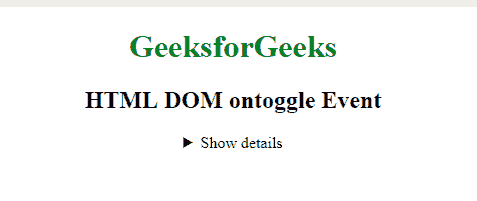
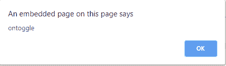
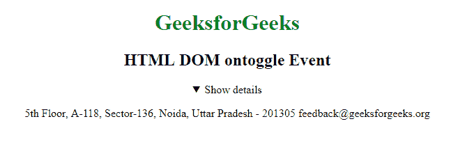

# HTML | DOM 本体事件

> 原文:[https://www.geeksforgeeks.org/html-dom-ontoggle-event/](https://www.geeksforgeeks.org/html-dom-ontoggle-event/)

当用户打开或关闭 **<【细节】>** 元素时，HTML DOM 中的**本体事件**发生。 **<详细信息>** 标签用于最初隐藏的内容/信息，但如果用户希望查看，可以显示。

**支持的标签**

**<详情>**

**语法:**

*   **在 HTML 中:**

```html
<element ontoggle="Script">
```

*   **在 JavaScript 中:**

```html
object.ontoggle = function(){Script};
```

*   **在 JavaScript 中，使用 addEventListener()方法:**

```html
object.addEventListener("toggle", Script);
```

**例:**

## 超文本标记语言

```html
<!DOCTYPE html>
<html>

<head>
    <title>HTML DOM ontoggle Event</title>
</head>

<body>
    <center>
        <h1 style="color:green">GeeksforGeeks</h1>
        <h2>HTML DOM ontoggle Event</h2>

        <details id="detailsID">
            <summary>Show details</summary>

<p>
              5th Floor, A-118,
              Sector-136, Noida, Uttar Pradesh - 201305
              feedback@geeksforgeeks.org
            </p>

        </details>

    </center>
    <script>
        document.getElementById(
          "detailsID").addEventListener("toggle", GFGfun);

        function GFGfun() {
            alert("ontoggle");
        }
    </script>

</body>

</html>
```

**输出:**
**前:**



**之后:**





**支持的浏览器:**T2 DOM 本体事件支持的浏览器如下:

*   谷歌 Chrome
*   微软公司出品的 web 浏览器
*   火狐浏览器
*   苹果 Safari
*   歌剧