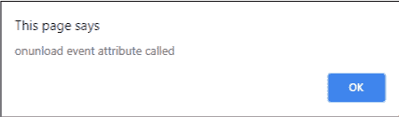

# HTML | DOM 未加载事件

> 原文:[https://www.geeksforgeeks.org/html-dom-onunload-event/](https://www.geeksforgeeks.org/html-dom-onunload-event/)

一旦页面被卸载，HTML 中的**未加载事件**就会发生。例如，当页面正在加载并且浏览器窗口已经被用户关闭或提交表单时，点击链接等。
页面重新加载时也会发生此事件。

**支持的标签**

**语法:**

*   **在 HTML 中:**

```html
<element onunload="myScript">
```

*   **在 JavaScript 中:**

```html
object.onunload = function(){myScript};
```

*   **在 JavaScript 中，使用 addEventListener()方法:**

```html
object.addEventListener("unload", myScript); 
```

**示例:**使用 addEventListener()方法

## 超文本标记语言

```html
<!DOCTYPE html>
<html>

<head>
    <title>HTML DOM onunload Event</title>
</head>

<body id="bID" onunload="GFGfun()">
    <center>
        <h1 style="color:green">GeeksforGeeks</h1>
        <h2>HTML DOM onunload Event</h2>
    </center>

    <script>
        document.getElementById(
            "bID").addEventListener("unload", GFGfun);

        function GFGfun() {
            alert("onunload event attribute called");
        }
    </script>

</body>

</html>
```

**输出:**



**注意:**此事件可能不会总是如预期的那样工作。
**支持的浏览器:****HTML DOM on nload Event**支持的浏览器如下:

*   谷歌 Chrome
*   微软公司出品的 web 浏览器
*   火狐浏览器
*   苹果 Safari
*   歌剧