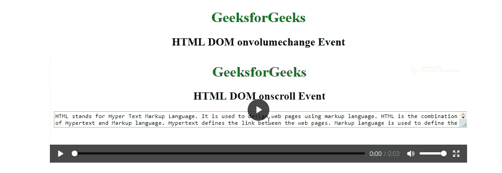
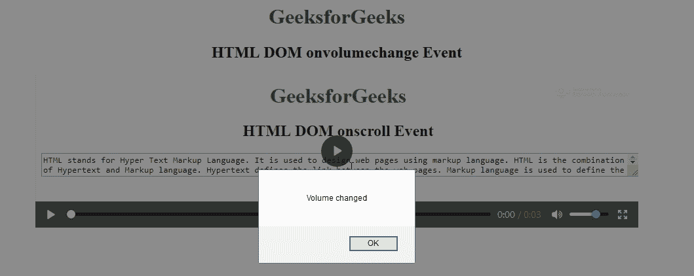

# HTML | DOM 坚决变更事件

> 原文:[https://www . geeksforgeeks . org/html-DOM-onvolumechange-event/](https://www.geeksforgeeks.org/html-dom-onvolumechange-event/)

HTML DOM 中的 **onvolumechange 事件**发生在媒体卷更改时。使用 volume 属性设置/返回媒体的音量。
此事件由
调用

*   音量增大/减小
*   静音/取消静音媒体播放器

**支持的标签**

**语法:**

*   **在 HTML 中:**

```html
<element onvolumechange="myScript">
```

*   **在 JavaScript 中:**

```html
object.onvolumechange = function(){myScript};
```

*   **在 JavaScript 中，使用 addEventListener()方法:**

```html
object.addEventListener("volumechange", myScript);
```

**示例:**使用 addEventListener()方法

## 超文本标记语言

```html
<!DOCTYPE html>
<html>

<head>
    <title>
      HTML DOM onvolumechange Event
  </title>
</head>

<body>
    <center>
        <h1 style="color:green">GeeksforGeeks</h1>
        <h2>HTML DOM onvolumechange Event</h2>

        <video controls id="videoID">
            <source src="GFG.mp4" type="video/mp4">
        </video>

    </center>
    <script>
        document.getElementById(
          "videoID").addEventListener("volumechange", GFGfun);

        function GFGfun() {
            alert("Volume changed");
        }
    </script>

</body>

</html>
```

**输出:**
**前:**



**之后:**



**支持的浏览器:****DOM onvolumechange Event**支持的浏览器如下:

*   谷歌 Chrome
*   微软公司出品的 web 浏览器
*   火狐浏览器
*   苹果 Safari
*   歌剧