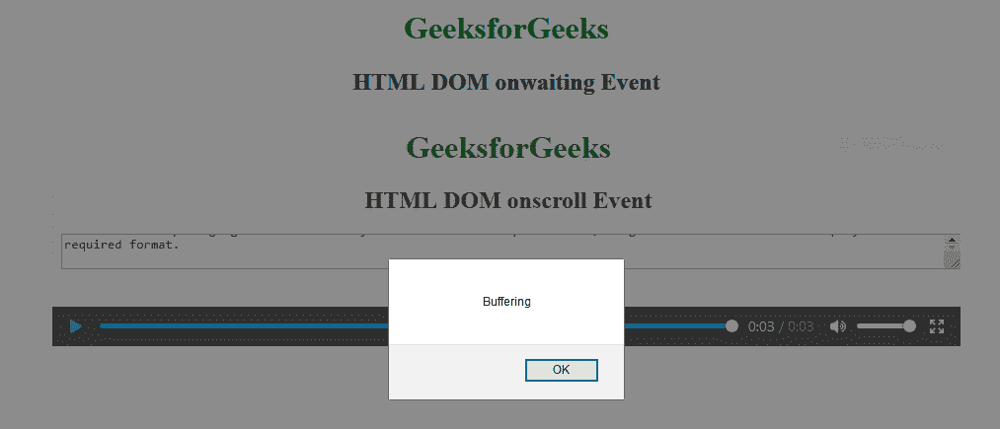

# HTML | DOM onwaiting 事件

> 原文:[https://www.geeksforgeeks.org/html-dom-onwaiting-event/](https://www.geeksforgeeks.org/html-dom-onwaiting-event/)

HTML DOM 中的 **onwaiting 事件**发生在视频停止缓冲下一帧时。

**支持的标签:**

*   声音的
*   录像

**语法:**

*   **在 HTML 中:**

    ```html
    <element onwaiting="Script">
    ```

*   **在 JavaScript 中:**

    ```html
    object.onwaiting = function(){Script};
    ```

*   **在 JavaScript 中，使用 addEventListener()方法:**

    ```html
    object.addEventListener("waiting", Script);
    ```

**示例:**使用 addEventListener()方法

```html
<!DOCTYPE html>
<html>

<head>
    <title>HTML DOM onwaiting Event</title>
</head>

<body>
    <center>
        <h1 style="color:green">GeeksforGeeks</h1>
        <h2>HTML DOM onwaiting Event</h2>

        <video controls id="videoID">
            <source src="GFG.mp4" type="video/mp4">
        </video>

    </center>
    <script>
        document.getElementById(
          "videoID").addEventListener("waiting", GFGfun);

        function GFGfun() {
            alert("Buffering");
        }
    </script>

</body>

</html>
```

**输出:**


**支持的浏览器:**等待事件上 **HTML DOM 支持的浏览器如下:**

*   谷歌 Chrome
*   微软公司出品的 web 浏览器
*   火狐浏览器
*   苹果 Safari
*   歌剧