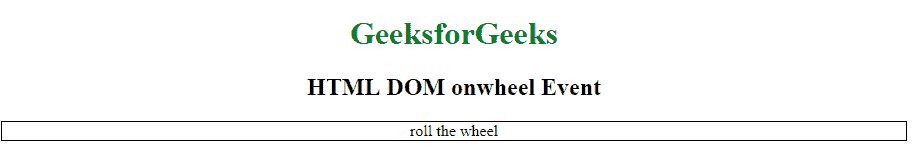
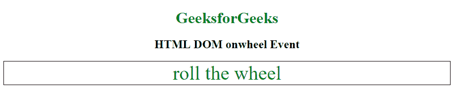

# HTML | DOM onwheel 事件

> 原文:[https://www.geeksforgeeks.org/html-dom-onwheel-event/](https://www.geeksforgeeks.org/html-dom-onwheel-event/)

当鼠标滚轮在一个元素上旋转时，就会发生 HTML DOM 中的 **onwheel 事件**。当用户滚动或放大或缩小元素时，也会触发此事件。onwheel 事件也可以在触摸板上工作。

**支持的 Tagst**

*   所有元素都支持这个事件

**语法:**

*   **在 HTML 中:**

```html
<element onwheel="Script">
```

*   **在 JavaScript 中:**

```html
object.onwheel = function(){Script};
```

*   **在 JavaScript 中，使用 addEventListener()方法:**

```html
object.addEventListener("wheel", Script);
```

**示例:**使用 addEventListener()方法

## 超文本标记语言

```html
<!DOCTYPE html>
<html>

<head>
    <title>HTML DOM onwheel Event</title>
    <style>
        #divID {
            border: 1px solid black;
        }
    </style>
</head>

<body>
    <center>
        <h1 style="color:green">GeeksforGeeks</h1>
        <h2>HTML DOM onwheel Event</h2>

        <div id="divID">roll the wheel</div>
    </center>
    <script>
        document.getElementById(
          "divID").addEventListener("wheel", GFGfun);

        function GFGfun() {
            this.style.fontSize = "40px";
            this.style.color = "green";
        }
    </script>

</body>

</html>
```

**输出:**
**前:**



**之后:**



**支持的浏览器:****HTML DOM on wheel Event**支持的浏览器如下:

*   谷歌 Chrome 31.0
*   Internet Explorer 9.0
*   Firefox 17.0
*   Opera 18.0