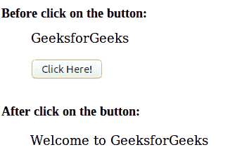

# HTML | DOM open()方法

> 原文:[https://www.geeksforgeeks.org/html-dom-open-method/](https://www.geeksforgeeks.org/html-dom-open-method/)

HTML 中的 **DOM Open()** 方法是以下三个步骤的组合:

*   打开输出流以收集输出。
*   从 document.write()或 document.writeln()方法收集输出。
*   运行文档。关闭显示写入输出流的输出。

**语法:**

```html
document.open( MIMEtype, replace )
```

**参数值:**该方法接受以下两个参数:

*   **MIMEtype:** 是文档的类型，是可选参数。该参数的默认值为“文本/html”。
*   **替换:**为可选参数。如果设置了该值，则新文档的历史条目将继承该文档的历史条目。

**例 1:**

```html
<!DOCTYPE html>
<html>
    <head>
        <title>DOM open() Method</title>
    </head>

    <body>
        <p>GeeksforGeeks</p>

        <button onclick = "Geeks()">
            Click Here!
        </button>

        <script>
            function Geeks() {

                /* DOM open() method used here */
                document.open("text/html", "replace");
                document.write("<html><body><p>Welcome to "
                    + "GeeksforGeeks</p></body></html>");
                document.close();
            }
        </script>
    </body>
</html>                    
```

**输出:**


**示例 2:** 本示例在新窗口中显示输出。

```html
<!DOCTYPE html>
<html>
    <head>
        <title>DOM open() Method</title>
    </head>

    <body>
        <p>GeeksforGeeks</p>

        <button onclick = "Geeks()">
            Click Here!
        </button>

        <script>
            function Geeks() {

                var x = window.open();

                /* DOM open() method used here */
                x.document.open("text/html", "replace");
                x.document.write("<html><body><p>Welcome to "
                    + "GeeksforGeeks</p></body></html>");
                x.document.close();
            }
        </script>
    </body>
</html>                    
```

**输出:**


**支持的浏览器:**下面列出了 *DOM open()* 方法支持的浏览器:

*   谷歌 Chrome
*   微软公司出品的 web 浏览器
*   火狐浏览器
*   歌剧
*   旅行队