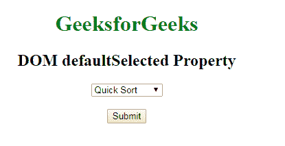
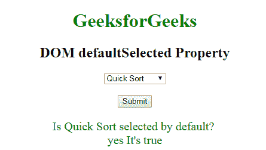

# HTML | DOM 选项默认值选定属性

> 原文:[https://www . geesforgeks . org/html-DOM-option-default selected-property/](https://www.geeksforgeeks.org/html-dom-option-defaultselected-property/)

**DOM 选项默认选定属性**用于返回选定属性的默认值。HTML 中的选定属性用于指定页面加载时默认情况下应该选择哪个选项。这是一个布尔属性。默认情况下，将显示具有选定属性的选项。

**语法:**

*   它用于返回属性。

```html
optionObject.defaultSelected 
```

**返回值:**返回一个布尔值，表示默认情况下选项是否被选中。
**示例:**此示例说明如何返回所选属性。

## 超文本标记语言

```html
<!DOCTYPE html>
<html>
    <head>
        <title>DOM  defaultSelected Property</title>
    </head>
    <body style = "text-align: center;">

        <h1 style = "color: green;">GeeksforGeeks</h1>
        <h2>DOM defaultSelected Property</h2>

        <!-- List of Options -->
        <select id="GFG">
            <option value="merge">Merge Sort</option>
            <option value="bubble">Bubble Sort</option>
            <option value="insertion">Insertion Sort</option>

            <!-- Option element with selected attribute -->
            <option value="quick" selected>Quick Sort</option>
        </select><br><br>

     <button onclick="myGeeks()">Submit</button>
     <p id="sudo" style="font-size:20px;color:green;"></p>

        <script>
        function myGeeks() {
       var x = document.getElementById("GFG").selectedIndex;
       var y = document.getElementsByTagName("option");
       document.getElementById("sudo").innerHTML =
                       "Is " + y[x].text + " selected by default? "
                      + "<br>" + "yes It's " + y[x].defaultSelected;
}
</script>
    </body>
</html>                    
```

**输出:**
**点击按钮前:**



**点击按钮后:**



**支持的浏览器:**T2 DOM 选项默认选择属性支持的浏览器如下:

*   谷歌 Chrome
*   微软公司出品的 web 浏览器
*   火狐浏览器
*   歌剧
*   旅行队