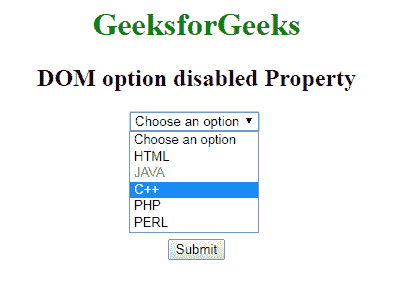
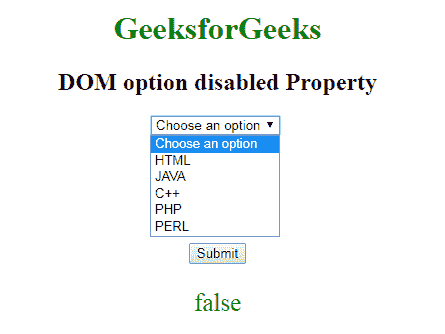

# HTML | DOM 选项禁用属性

> 原文:[https://www . geesforgeks . org/html-DOM-option-disabled-property/](https://www.geeksforgeeks.org/html-dom-option-disabled-property/)

**DOM 选项禁用属性**用于**设置**或**返回**选项的值是否为*禁用*。HTML 中元素的禁用属性用于指定选项值被禁用。禁用的选项不可点击且不可用。它是一个*布尔属性*。

**语法:**

*   它用于返回禁用的属性。

    ```html
    optionObject.disabled
    ```

*   它用于设置禁用属性。

    ```html
    optionObject.disabled = true|false
    ```

**属性值:**

*   **真:**定义选项被禁用。
*   **false:** 定义选项值未禁用。它有一个默认值。

**返回值:**返回一个布尔值，表示选项值是否被禁用。

**示例-1:** 本示例说明如何设置属性。

```html
<!DOCTYPE html>
<html>

<head>
    <title>DOM option disabled Property</title>
    <style>
        body {
            text-align: center;
        }

        h1 {
            color: green;
        }
    </style>
</head>

<body>
    <h1>GeeksforGeeks</h1>
    <h2>DOM option disabled Property</h2>
    <select id="GFG">
        <option>Choose an option</option>
        <option value="html">HTML</option>
        <option value="java">JAVA</option>
        <option value="C++">C++</option>
        <option value="php">PHP</option>
        <option value="perl">PERL</option>
    </select>
    <br>
    <br>
    <br>
    <br>
    <br>
    <br>
    <br>
    <button onclick="myGeeks()">Submit</button>

    <script>
        function myGeeks() {

            // Set disabled property "true".
            var x = document.getElementById(
             "GFG").options[2].disabled = true;
        }
    </script>

</body>

</html>
```

**输出:**

**点击按钮前:**


**点击按钮后:**


**示例-2 :** 本示例说明如何返回禁用的属性。

```html
<!DOCTYPE html>
<html>

<head>
    <title>DOM option disabled Property</title>
    <style>
        body {
            text-align: center;
        }

        h1 {
            color: green;
        }
    </style>
</head>

<body>
    <h1>GeeksforGeeks</h1>
    <h2>DOM option disabled Property</h2>
    <select id="GFG">
        <option>Choose an option</option>
        <option value="html">HTML</option>
        <option value="java">JAVA</option>
        <option value="C++">C++</option>
        <option value="php">PHP</option>
        <option value="perl">PERL</option>
    </select>
    <br>
    <br>
    <br>
    <br>
    <br>
    <br>
    <br>
    <button onclick="myGeeks()">Submit</button>
    <p id="sudo" style="font-size:25px;color:green;">
  </p>

    <script>
        function myGeeks() {

            // Return disabled property.
            var x = document.getElementById(
              "GFG").options[2].disabled;

            document.getElementById("sudo").innerHTML = x;
        }
    </script>

</body>

</html>
```

**输出:**

**点击按钮前:**


**点击按钮后:**


**支持的浏览器:**禁用属性的 *DOM 选项支持的浏览器如下:*

*   谷歌 Chrome
*   微软公司出品的 web 浏览器
*   火狐浏览器
*   歌剧
*   旅行队