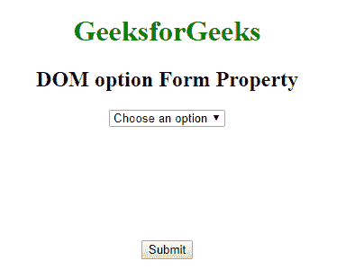
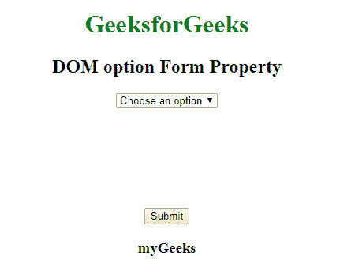

# HTML | DOM 选项表单属性

> 原文:[https://www . geesforgeks . org/html-DOM-option-form-property/](https://www.geeksforgeeks.org/html-dom-option-form-property/)

HTML DOM 中的**选项表单属性**用于返回属于**选项**元素的表单的引用。此属性是只读的，成功时返回一个表单对象。

**语法:**

```html
optionObject.form 
```

**返回值:**返回对包含选项元素的表单的引用。如果选项不在表单中，它将返回空值。

**示例:**本示例返回一个期权表单属性。

```html
<!DOCTYPE html>
<html>

<head>
    <title>
      DOM option form Property
  </title>
    <style>
        body {
            text-align: center;
        }

        h1 {
            color: green;
        }
    </style>
</head>

<body>
    <h1>GeeksforGeeks</h1>
    <h2>DOM option Form Property</h2>
    <form id="myGeeks">
        <select id="GFG">
            <option id="sudo">
              Choose an option
          </option>
            <option value="html">
              HTML
          </option>
            <option value="java">
              JAVA
          </option>
            <option value="C++">
              C++
          </option>
            <option value="php">
              PHP
          </option>
            <option value="perl">
              PERL
          </option>
        </select>
    </form>
    <br>
    <br>
    <br>
    <br>
    <br>
    <br>
    <br>
    <button onclick="myGeeks()">
      Submit
  </button>
    <h3 id="demo"></h3>
    <script>
        function myGeeks() {

            var x = document.getElementById(
                "sudo").form.id;
            document.getElementById(
              "demo").innerHTML = x;
        }
    </script>

</body>

</html>
```

**点击按钮前:**

**点击按钮后:**


**支持的浏览器:****DOM 选项表单属性**支持的浏览器如下:

*   谷歌 Chrome
*   微软公司出品的 web 浏览器
*   火狐浏览器
*   苹果 Safari
*   歌剧