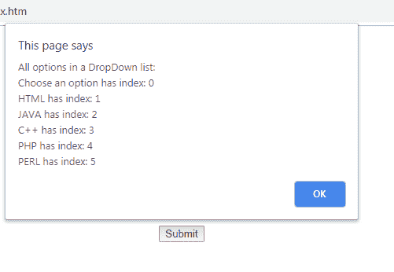

# HTML | DOM 选项索引属性

> 原文:[https://www . geesforgeks . org/html-DOM-option-index-property/](https://www.geeksforgeeks.org/html-dom-option-index-property/)

**DOM 选项索引属性**用于**设置**或**返回**下拉列表中选项值的索引位置。索引从零开始。

**语法:**

*   它用于返回索引属性。

    ```html
    optionObject.index
    ```

*   它用于设置索引属性。

    ```html
    optionObject.index = integer 
    ```

**属性值:**

*   它定义了下拉菜单列表中选项值的索引位置的整数值。

**返回值:**返回一个数值，代表期权价值的指数位置。

**示例-1:** 本示例说明如何返回下拉列表中的选项值。

```html
<!DOCTYPE html>
<html>

<head>
    <title>DOM option index Property
  </title>
    <style>
        body {
            text-align: center;
        }

        h1 {
            color: green;
        }
    </style>
</head>

<body>
    <h1>GeeksforGeeks</h1>
    <h2>DOM option index Property</h2>
    <select id="GFG">
        <option>Choose an option
      </option>
        <option value="html">HTML
      </option>
        <option value="java">JAVA
      </option>
        <option value="C++">C++
      </option>
        <option value="php">PHP
      </option>
        <option value="perl">PERL
      </option>
    </select>
    <br>
    <br>
    <br>
    <br>
    <br>
    <br>
    <br>

    <button onclick="myGeeks()">Submit
  </button>

    <p id="sudo"
       style="font-size:25px;
              color:green;">
  </p>

    <script>
        function myGeeks() {

            // Return option value.
            var x = document.getElementById(
              "GFG").selectedIndex;

            var y = document.getElementById(
              "GFG").options;

            document.getElementById("sudo").innerHTML = 
              (y[x].text + " is in " + y[x].index +
               "th " + "index position");
        }
    </script>
</body>

</html>
```

**输出:**

**点击按钮前:**


**点击按钮后:**


**示例-2:** 该示例说明了如何显示选项的所有索引位置。

```html
<!DOCTYPE html>
<html>

<head>
    <title>DOM option index Property
  </title>
    <style>
        body {
            text-align: center;
        }

        h1 {
            color: green;
        }
    </style>
</head>

<body>
    <h1>GeeksforGeeks</h1>
    <h2>DOM option index Property</h2>
    <select id="GFG">
        <option>Choose an option</option>
        <option value="html">HTML</option>
        <option value="java">JAVA</option>
        <option value="C++">C++</option>
        <option value="php">PHP</option>
        <option value="perl">PERL</option>
    </select>
    <br>
    <br>
    <br>
    <br>
    <br>
    <br>
    <br>
    <button onclick="myGeeks()">Submit
  </button>

    <p id="sudo"
       style="font-size:25px;
              color:green;">
    </p>

    <script>
        function myGeeks() {

            // display all option.
            var w = 
            document.getElementById("GFG");

            var txt =
            "All options in a DropDown list: ";

            var i;
            for (i = 0; i < w.length; i++) {
                txt = txt + "\n" + w.options[i].text + 
                  " has index: " + w.options[i].index;
            }
            alert(txt);
        }
    </script>
</body>

</html>
```

**输出:**

**点击按钮前:**


**点击按钮后:**


**支持的浏览器:**T2 DOM 选项索引属性支持的浏览器如下:

*   谷歌 Chrome
*   微软公司出品的 web 浏览器
*   火狐浏览器
*   歌剧
*   旅行队