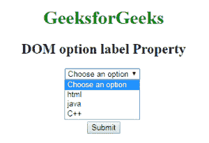
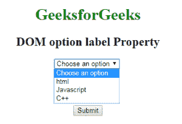
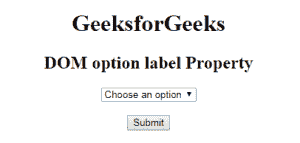
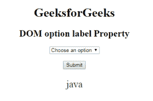

# HTML | DOM 选项标签属性

> 原文:[https://www . geesforgeks . org/html-DOM-option-label-property/](https://www.geeksforgeeks.org/html-dom-option-label-property/)

HTML DOM 中的**选项标签**属性用于设置或返回<选项>元素中标签属性的值。标签属性用于指定选项的标签。该属性包含代表选项短标签的文本值。

**语法:**

*   它用于返回标签属性。

    ```html
    optionObject.label
    ```

*   It is used to set the label property.

    ```html
    optionObject.label = text
    ```

    **属性值:**该属性包含单值*文本*，用于表示选项的短标签。

    **返回值:**返回一个字符串值，代表选项元素或下拉列表中的最短标签。

    **示例 1:** 本示例介绍如何设置选项标签属性。

    ```html
    <!DOCTYPE html> 
    <html> 
        <head> 
            <title>
                HTML DOM Option label Property
            </title>
        </head>

        <body style="text-align:center;"> 

            <h1 style="color:green;">
                GeeksforGeeks
            </h1> 

            <h2>DOM option label Property</h2> 

            <select> 
                <option>Choose an option</option> 
                <option id="GFG" label="html">HTML</option> 
                <option id="Geeks" label="java">JAVA</option> 
                <option id="sudo" label="C++">C++</option> 
            </select> <br><br><br><br><br>

            <button onclick = "myGeeks()">
                Submit
            </button>

            <!-- script to use option label property -->
            <script>
                function myGeeks() {
                    document.getElementById("Geeks").label
                            = "Javascript";             
                }
            </script>
        </body> 
    </html>                                                                          
    ```

    **输出:**
    **点击按钮前:**
    
    **点击按钮后:**
    

    **示例 2:** 本示例介绍如何返回 Option 标签属性。

    ```html
    <!DOCTYPE html>
    <html>

    <head>
        <title>
            HTML DOM option label Property
        </title>
    </head>

    <body style = "text-align:center;">

        <h1>GeeksforGeeks</h1> 

        <h2>DOM option label Property</h2> 

        <select> 
            <option>Choose an option</option> 
            <option id="GFG" label="html">HTML</option> 
            <option id="Geeks" label="java">JAVA</option> 
            <option id="sudo" label="C++">C++</option> 
        </select>

        <br><br>

        <button onclick = "myGeeks()">
            Submit
        </button>

        <p id="demo" style="font-size:25px;color:green;"></p>

        <!-- script to return option label property -->
        <script>
            function myGeeks() {
                var x = document.getElementById("Geeks").label;
                document.getElementById("demo").innerHTML = x;
            }
        </script>
    </body>

    </html>                    
    ```

    **输出:**
    **点击按钮前:**
    
    **点击按钮后:**
    

    **支持的浏览器:***DOM Option 标签属性*支持的浏览器如下:

    *   谷歌 Chrome
    *   微软公司出品的 web 浏览器
    *   火狐浏览器
    *   歌剧
    *   旅行队