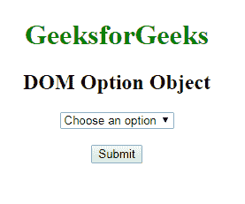
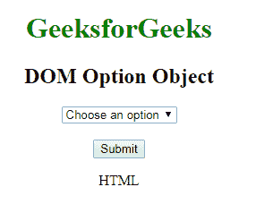
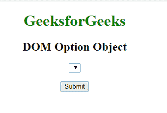
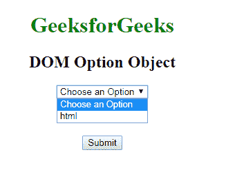

# HTML | DOM 选项对象

> 原文:[https://www.geeksforgeeks.org/html-dom-option-object/](https://www.geeksforgeeks.org/html-dom-option-object/)

**DOM 选项对象**用于表示 HTML [<选项>](https://www.geeksforgeeks.org/html-option-tag/) 元素。通过**获取元素 ById()** 可以访问选项元素。

**属性:**

*   **禁用:**该属性包含禁用的值，表示选项被禁用。
*   **标签:**该属性包含代表选项短标签的文本值。
*   **选定:**该属性包含选定的值，该值代表浏览器加载时预先选定的项目。
*   **值:**该属性包含发送到服务器的值文本。

**语法:**

```html
document.getElementById("ID");
```

其中**“id”**是分配给**“选项”**标签的 ID。

**示例-1:**

```html
<!DOCTYPE html>
<html>

<head>
    <title> DOM Option Object</title>
    <style>
        body {
            text-align: center;
        }

        h1 {
            color: green;
        }
    </style>
</head>

<body>
    <h1>GeeksforGeeks</h1>
    <h2>DOM Option Object</h2>
    <select>
        <option>Choose an option</option>

        <!-- Assigning id to option tag. -->
        <option id="GFG" value="html">HTML</option>
        <option value="java">JAVA</option>
        <option value="C++">C++</option>
        <option value="php">PHP</option>
        <option value="perl">PERL</option>
    </select>
    <br>
    <br>
    <button onclick="geeks()">Submit</button>
    <p id="sudo"></p>
    <script>
        function geeks() {

            //  Accessing option object.
            var g = document.getElementById(
              "GFG").text;
            document.getElementById("sudo").innerHTML = g;
        }
    </script>
</body>

</html>
```

：

**输出:**

**点击按钮前:**


**点击按钮后:**


**示例-2:** *选项对象*可以使用**文档. createElement 方法创建。**

```html
<!DOCTYPE html>
<html>

<head>
    <title> DOM Option Object</title>
    <style>
        body {
            text-align: center;
        }

        h1 {
            color: green;
        }
    </style>
</head>

<body>
    <h1>GeeksforGeeks</h1>
    <h2>DOM Option Object</h2>
    <select id="GFG">
    </select>
    <br>
    <br>
    <button onclick="geeks()">Submit</button>
    <p id="sudo"></p>
    <script>
        function geeks() {

            //  Creating option object.
            var g = document.createElement("OPTION");

            var f = document.createTextNode(
              "Choose an Option");

            g.appendChild(f);
            document.getElementById("GFG").appendChild(g);
            var x = document.createElement("OPTION");
            x.setAttribute("value", "HTML");
            var t = document.createTextNode("html");
            x.appendChild(t);
            document.getElementById("GFG").appendChild(x);
        }
    </script>
</body>

</html>
```

**输出:**

**点击按钮前:**


**点击按钮后:**


**支持的浏览器:****DOM 选项对象**支持的浏览器如下:

*   谷歌 Chrome
*   微软公司出品的 web 浏览器
*   火狐浏览器
*   歌剧
*   旅行队