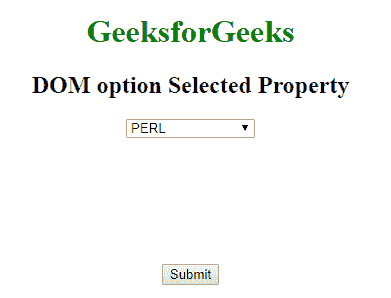
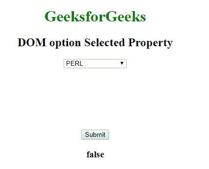
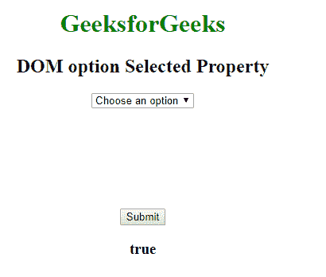

# HTML | DOM 选项选择属性

> 原文:[https://www . geesforgeks . org/html-DOM-option-selected-property/](https://www.geeksforgeeks.org/html-dom-option-selected-property/)

HTML DOM 中的**选项选择属性**用于设置或返回 **<选项>** 元素的选定状态的值。这是一个布尔属性。

**语法:**

*   它返回选定的属性。

    ```html
    optionObject.selected 
    ```

*   它设置选定的属性。

    ```html
    optionObject.selected = true|false
    ```

**属性值:**它包含一个**布尔**值，该值指定是否选择该选项。

*   **真:**表示选择了该选项。
*   **假:**有默认值。不会选择选项。

**返回值:**返回一个布尔值，表示该选项是否被选中。

**示例-1:** 本示例返回一个选项选定属性。

```html
<!DOCTYPE html>
<html>

<head>
    <title>
      DOM option Selected Property
  </title>
    <style>
        body {
            text-align: center;
        }

        h1 {
            color: green;
        }
    </style>
</head>

<body>
    <h1>GeeksforGeeks</h1>
    <h2>DOM option Selected Property</h2>
    <form id="myGeeks">
        <select id="GFG">
            <option id="sudo">
              Choose an option
          </option>
            <option value="html">
              HTML
          </option>
            <option value="java">
              JAVA
          </option>
            <option value="C++">
              C++
          </option>
            <option value="php">
              PHP
          </option>
            <option value="perl" selected>
              PERL
          </option>
        </select>
    </form>
    <br>
    <br>
    <br>
    <br>
    <br>
    <br>
    <br>
    <button onclick="myGeeks()">
      Submit
  </button>
    <h3 id="demo"></h3>
    <script>
        function myGeeks() {

            var x = document.getElementById(
                "sudo").selected;
            document.getElementById(
              "demo").innerHTML = x;
        }
    </script>

</body>

</html>
```

**点击按钮前:**

**点击按钮后:**


**示例-2:** 本示例设置选项选定属性。

```html
<!DOCTYPE html>
<html>

<head>
    <title>
      DOM option Selected Property
  </title>
    <style>
        body {
            text-align: center;
        }

        h1 {
            color: green;
        }
    </style>
</head>

<body>
    <h1>GeeksforGeeks</h1>
    <h2>DOM option Selected Property</h2>
    <form id="myGeeks">
        <select id="GFG">
            <option id="sudo">
              Choose an option
          </option>
            <option value="html">
              HTML
          </option>
            <option value="java">
              JAVA
          </option>
            <option value="C++">
              C++
          </option>
            <option value="php">
              PHP
          </option>
            <option value="perl" selected>
              PERL
          </option>
        </select>
    </form>
    <br>
    <br>
    <br>
    <br>
    <br>
    <br>
    <br>
    <button onclick="myGeeks()">
      Submit
  </button>
    <h3 id="demo"></h3>
    <script>
        function myGeeks() {

            var x = document.getElementById(
                "sudo").selected = true;

            document.getElementById(
              "demo").innerHTML = x;
        }
    </script>

</body>

</html>
```

**点击按钮前:**

**点击按钮后:**


**支持的浏览器:**所选 **DOM 选项属性**支持的浏览器如下:

*   谷歌 Chrome
*   微软公司出品的 web 浏览器
*   火狐浏览器
*   苹果 Safari
*   歌剧