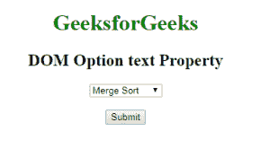
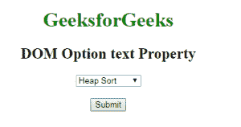
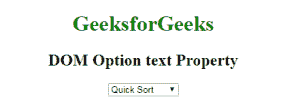
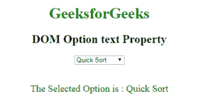

# HTML | DOM 选项文本属性

> 原文:[https://www . geesforgeks . org/html-DOM-option-text-property/](https://www.geeksforgeeks.org/html-dom-option-text-property/)

HTML DOM 中的**选项文本属性**用于设置或返回<选项>元素的文本。用户提交表单时发送到服务器的文本值。

**语法:**

*   它用于返回选项文本属性。

    ```html
    optionObject.text
    ```

*   It is used to set the Option text Property.

    ```html
    optionObject.text = text
    ```

    **属性值:**它包含单个值**文本**，该文本定义了<选项>元素的文本内容。

    **返回值:**返回一个代表选项元素文本内容的字符串值。

    **示例 1:** 本示例说明如何设置选项文本属性。

    ```html
    <!DOCTYPE html> 
    <html> 

    <head> 
        <title>
            HTML DOM Option text Property
        </title> 
    </head>

    <body style = "text-align: center;">

        <h1 style = "color: green;">
            GeeksforGeeks
        </h1> 

        <h2>DOM Option text Property</h2> 

        <!-- List of Options -->
        <select> 
            <option id="GFG">Merge Sort</option> 
            <option id="geeks">Bubble Sort</option> 
            <option id="user">Insertion Sort</option>
            <option id="java">Quick Sort</option> 
        </select>

        <br><br>

        <button onclick="myGeeks()">
            Submit
        </button>

        <!-- script to set option text -->
        <script>
            function myGeeks() {
                var x = document.getElementById("GFG").text
                        = "Heap Sort";
            }
        </script>
    </body> 

    </html>                                    
    ```

    **输出:**
    **点击按钮前:**
    
    **点击按钮后:**
    

    **示例 2:** 本示例说明如何返回选项文本属性。

    ```html
    <!DOCTYPE html> 
    <html> 

    <head> 
        <title>
            HTML DOM Option text Property
        </title> 
    </head> 

    <body style = "text-align: center;">

        <h1 style = "color: green;">
            GeeksforGeeks
        </h1> 

        <h2>DOM Option text Property</h2> 

        <!-- List of Options -->
        <select onchange="myGeeks(this)"> 
            <option id="GFG">Merge Sort</option> 
            <option id="geeks">Bubble Sort</option> 
            <option id="user">Insertion Sort</option>
            <option id="java">Quick Sort</option> 
        </select>

        <br><br>

        <p id="sudo" style="font-size:20px;color:green;"></p>

        <!-- script to return Option text -->
        <script>
            function myGeeks(selTag) {
                var x = selTag.options[selTag.selectedIndex].text;
                document.getElementById("sudo").innerHTML
                    = "The Selected Option is : " + x;
            }
        </script>
    </body> 

    </html>                    
    ```

    **输出:**
    **选择选项前:**
    
    **选择选项后“**
    

    **支持的浏览器:***DOM 选项文本属性*支持的浏览器如下:

    *   谷歌 Chrome
    *   微软公司出品的 web 浏览器
    *   火狐浏览器
    *   歌剧
    *   旅行队