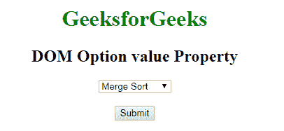
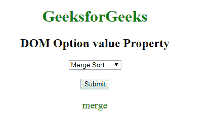
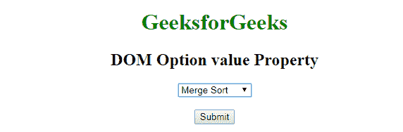
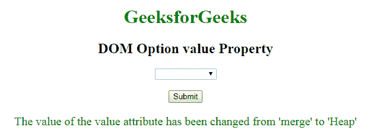

# HTML | DOM 选项值属性

> 原文:[https://www . geesforgeks . org/html-DOM-option-value-property/](https://www.geeksforgeeks.org/html-dom-option-value-property/)

HTML DOM 中的**选项值属性**用于设置或返回<选项>元素的值。该值在提交表单时发送到服务器。该属性包含发送到服务器的值文本。

**语法:**

*   它返回选项值属性。

    ```html
    optionObject.value 
    ```

*   It is used to set the option value property.

    ```html
    optionObject.value = value 
    ```

    **属性值:**包含单个属性值**值**。该属性包含发送到服务器的值文本。

    **返回值:**返回一个字符串值，代表发送给服务器的文本值。

    **示例 1:** 本示例说明如何返回 Option 值属性。

    ```html
    <!DOCTYPE html> 
    <html> 

    <head> 
        <title>
            HTML DOM Option Value Property
        </title> 
    </head> 

    <body style = "text-align: center;">

        <h1 style = "color: green;">
            GeeksforGeeks
        </h1> 

        <h2>DOM Option value Property</h2> 

        <!-- List of Option elements -->
        <select id="GFG"> 
            <option value="merge">Merge Sort</option> 
            <option value="bubble">Bubble Sort</option> 
            <option value="insertion">Insertion Sort</option>
            <option value="quick">Quick Sort</option> 
        </select>

        <br><br>

        <button onclick="myGeeks()">
            Submit
        </button>

        <p id="sudo" style="font-size:20px;color:green;"></p>

        <!-- Script to return selected option value -->
        <script>
            function myGeeks() {
                var ind = document.getElementById("GFG").selectedIndex;
                var opt = document.getElementsByTagName("option")[ind].value;
                document.getElementById("sudo").innerHTML = opt;
            }
        </script>
    </body> 

    </html>                    
    ```

    **输出:**
    **点击按钮前:**
    
    **点击按钮后:**
    

    **示例 2:** 本示例说明如何设置 Option 值属性。

    ```html
    <!DOCTYPE html> 
    <html> 

    <head> 
        <title>
            HTML DOM Option Value Property
        </title> 
    </head> 

    <body style = "text-align: center;">

        <h1 style = "color: green;">
            GeeksforGeeks
        </h1> 

        <h2>DOM Option value Property</h2> 

        <!-- List of Options -->
        <select id="GFG"> 
            <option value="merge">Merge Sort</option> 
            <option value="bubble">Bubble Sort</option> 
            <option value="insertion">Insertion Sort</option>
            <option value="quick">Quick Sort</option> 
        </select>

        <br><br>

        <button onclick="myGeeks()">
            Submit
        </button>

        <p id="sudo" style="font-size:20px;color:green;"></p>

        <!-- script to set Option value property -->
        <script>
            function myGeeks() {
                document.getElementById("GFG").value = "Heap";

                document.getElementById("sudo").innerHTML
                    = "The value of the value attribute has "
                    + "been changed from 'merge' to 'Heap' ";
            }
        </script>
    </body> 

    </html>                    
    ```

    **输出:**
    **点击按钮前:**
    
    **点击按钮后:**
    

    **支持的浏览器:***DOM Option 值属性*支持的浏览器如下:

    *   谷歌 Chrome
    *   微软公司出品的 web 浏览器
    *   火狐浏览器
    *   歌剧
    *   旅行队