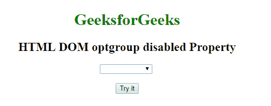
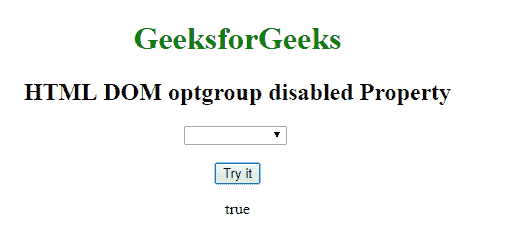
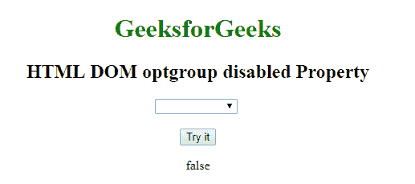

# HTML | DOM 选项组禁用属性

> 原文:[https://www . geesforgeks . org/html-DOM-option group-disabled-property/](https://www.geeksforgeeks.org/html-dom-optiongroup-disabled-property/)

HTML DOM 中的**选项组禁用属性**用于设置或返回选项组禁用属性。该属性检查 OptGroup 是否被禁用。禁用的<选项组>元素不可点击且不可用。它是一个布尔属性。
**语法:**

*   它返回一个选项组禁用属性。

```html
optiongroupObject.disabled
```

*   它设置选项组禁用属性。

```html
optiongroupObject.disabled = true|false
```

**房产价值:**

*   **true:** 指定禁用选项组。
*   **false:** 指定不禁用选项组。

**返回值:**返回一个布尔值，表示选项组是否被禁用。
**例 1:**

## 超文本标记语言

```html
<!DOCTYPE html>
<html>

<head>
        <title>
            HTML DOM OptionGroup disabled Property
        </title>
</head>

<body style = "text-align:center">    

    <h1 style = "color: green;">GeeksforGeeks</h1>

    <h2>HTML DOM optgroup disabled Property</h2>

    <select>

        <!--A disabled optgroup-->
        <optgroup id="GFG" label="Sorting Algorithms" disabled>
            <option value="merge">Merge sort</option>
            <option value="quick">Quick sort</option>
        </optgroup>
    </select>

    <br><br>

    <button onclick="myGeeks()">Try it</button>

    <p id="sudo"></p>

    <script>
        function myGeeks() {
            var g = document.getElementById("GFG").disabled;
            document.getElementById("sudo").innerHTML = g;
        }
    </script>
</body>

</html>
```

**输出:**

*   **点击按钮前:**



*   **点击按钮后:**



**例 2:**

## 超文本标记语言

```html
<!DOCTYPE html>
<html>

<head>
        <title>
            HTML DOM OptionGroup disabled Property
        </title>
</head>

<body style = "text-align:center">    

    <h1 style = "color: green;">GeeksforGeeks</h1>

    <h2>HTML DOM optgroup disabled Property</h2>

    <select>

        <!--A disabled optgroup-->
        <optgroup id="GFG" label="Sorting Algorithms" disabled>
            <option value="merge">Merge sort</option>
            <option value="quick">Quick sort</option>
        </optgroup>
    </select>

    <br><br>

    <button onclick="myGeeks()">Try it</button>

    <p id="sudo"></p>

    <script>
        function myGeeks() {
            var g = document.getElementById("GFG").disabled
                        = "false";

            document.getElementById("sudo").innerHTML = g;
        }
    </script>
</body>

</html>
```

**输出:**

*   **点击按钮前:**


*   **点击按钮后:**



**支持的浏览器:**HTML DOM 选项组禁用属性支持的浏览器如下:

*   谷歌 Chrome
*   微软公司出品的 web 浏览器
*   火狐浏览器
*   旅行队
*   歌剧