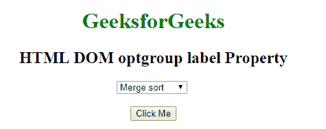
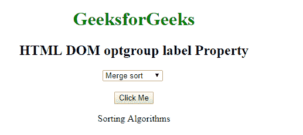
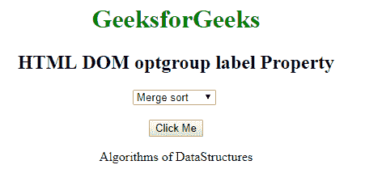

# HTML | DOM 选项组标签属性

> 原文:[https://www . geesforgeks . org/html-DOM-option group-label-property/](https://www.geeksforgeeks.org/html-dom-optiongroup-label-property/)

HTML DOM 中的**选项组标签属性**用于设置或返回<选项组>元素中标签属性的值。标签属性用于指定选项组元素的描述。

**语法:**

*   它返回 optiongroup 标签属性。

```html
optiongroupObject.label
```

*   它用于设置选项组标签属性。

```html
optiongroupObject.label = text
```

**属性值:**它包含单个值**文本**，该文本指定了光学组元素的描述。
**示例 1:** 本示例返回 OptionGroup 标签属性。

## 超文本标记语言

```html
<!DOCTYPE html>
<html>

<head>
    <title>
        HTML DOM optgroup label Property
    </title>
</head>

<body style = "text-align:center">    

    <h1 style = "color: green;">
        GeeksforGeeks
    </h1>

    <h2>HTML DOM optgroup label Property</h2>

    <select>

        <!--A label optgroup-->
        <optgroup label="Sorting Algorithms" id="GFG">
            <option value="merge">Merge sort</option>
            <option value="quick">Quick sort</option>
        </optgroup>
    </select>

    <br><br>

    <button onclick="myGeeks()">Click Me</button>

    <p id="sudo" style="font-size:20px;"></p>

    <script>
        function myGeeks() {
            var G = document.getElementById("GFG").label;
            document.getElementById("sudo").innerHTML = G;
        }
    </script>
</body>

</html>
```

*   **点击按钮前:**



*   **点击按钮后:**



**示例 2:** 本示例设置 optgroup 标签属性。

## 超文本标记语言

```html
<!DOCTYPE html>
<html>

<head>
    <title>
        HTML DOM optgroup label Property
    </title>
</head>

<body style = "text-align:center">    

    <h1 style = "color: green;">
        GeeksforGeeks
    </h1>

    <h2>HTML DOM optgroup label Property</h2>

    <select>

        <!--A label optgroup-->
        <optgroup label="Sorting Algorithms" id="GFG">
            <option value="merge">Merge sort</option>
            <option value="quick">Quick sort</option>
        </optgroup>
    </select>

    <br><br>

    <button onclick="myGeeks()">Click Me</button>

    <p id="sudo" style="font-size:20px;"></p>

    <script>
        function myGeeks() {
            var G = document.getElementById("GFG").label
                    = "Algorithms of DataStructures";

            document.getElementById("sudo").innerHTML = G;
        }
    </script>
</body>

</html>
```

*   **点击按钮前:**


*   **点击按钮后:**



**支持的浏览器:**HTML DOM 选项组标签属性支持的浏览器如下:

*   谷歌 Chrome
*   微软公司出品的 web 浏览器
*   火狐浏览器
*   旅行队
*   歌剧