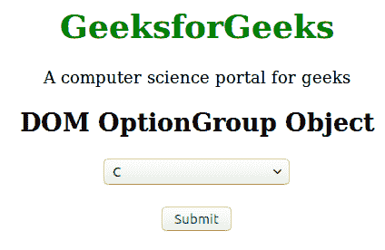
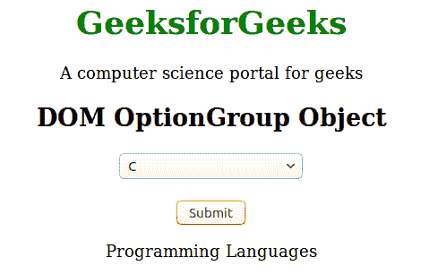
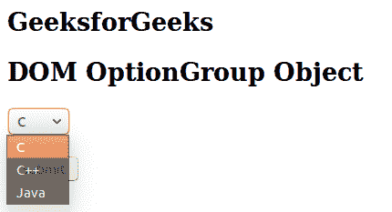
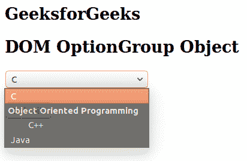

# html | DOM 选项组对象

> 原文:[https://www.geeksforgeeks.org/html-dom-optiongroup-object/](https://www.geeksforgeeks.org/html-dom-optiongroup-object/)

HTML DOM 中的 OptionGroup 对象用于表示 HTML optgroup 元素。使用 getElementById()方法可以访问<optgroup>元素。</optgroup>

**属性值:**该对象包含两个属性值，如下所示:

*   **禁用:**用于设置或返回选项组元素是否禁用。
*   **标签:**用于设置或返回选项组元素的标签属性的值。

**语法:**

```html
document.getElementById("ID");
```

其中标识被分配给<optgroup>元素。</optgroup>

**例 1:**

```html
<!DOCTYPE html> 
<html> 
    <head> 
        <title>
            HTML DOM Optgroup Object
        </title> 
    </head> 

    <body style = "text-align:center;"> 

        <h1 style = "color:green;">
            GeeksforGeeks
        </h1> 

        <div>
            A computer science portal for geeks 
        </div> 

        <h2>DOM OptionGroup Object</h2> 

        <select> 
            <optgroup id = "GFG" label = "Programming Languages"> 
                <option value = "C">C</option> 
                <option value = "C++">C++</option> 
                <option value = "Java">Java</optgroup> 
        </select> 

        <br><br>

        <button onclick = "Geeks()">
            Submit
        </button>

        <p id = "sudo"></p>

        <script>
            function Geeks() {
                var txt = document.getElementById("GFG").label;
                document.getElementById("sudo").innerHTML = txt;
            }
        </script>
    </body> 
</html>                                  
```

**输出:**
**点击按钮前:**

**点击按钮后:**


**示例 2:** 可以使用*文档创建元素*方法创建选项组对象。

```html
<!DOCTYPE html> 
<html> 
    <head> 
        <title>
            HTML DOM Optgroup Object
        </title> 
    </head> 

    <body> 
        <h2>GeeksforGeeks</h1> 

        <h2>DOM OptionGroup Object</h2> 

        <select id = "GFG"> 
            <option value = "C">C</option> 
            <option value = "C++">C++</option> 
            <option value = "Java">Java</optgroup> 
        </select> 

        <br><br>

        <button onclick = "Geeks()">
            Submit
        </button>

        <script>
            function Geeks() {
                var g = document.getElementById("GFG");

                var f = document.createElement("OPTGROUP");

                f.setAttribute("label", 
                            "Object Oriented Programming");

                f.appendChild(g.options[1]);

                g.insertBefore(f, g.options[1]);
            }
        </script>
    </body> 
</html>                                 
```

**输出:**
**点击按钮前:**

**点击按钮后:**


**支持的浏览器:**T2 DOM 选项组对象支持的浏览器如下:

*   谷歌 Chrome
*   微软公司出品的 web 浏览器
*   火狐浏览器
*   歌剧
*   旅行队