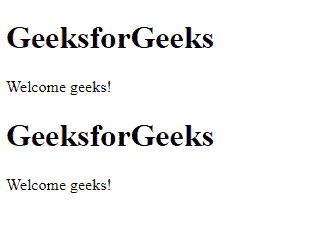
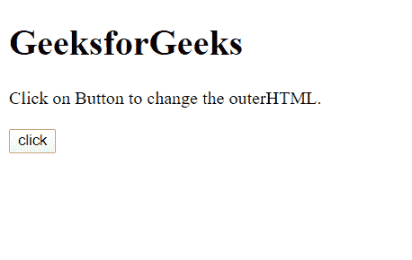
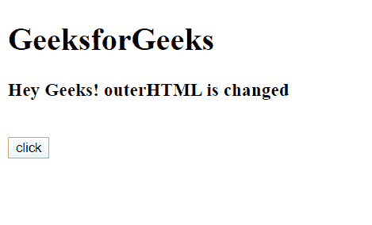

# HTML | DOM 外部 HTML 属性

> 原文:[https://www.geeksforgeeks.org/html-dom-outerhtml-property/](https://www.geeksforgeeks.org/html-dom-outerhtml-property/)

DOM 接口**的**外部 HTML** 属性给出了该元素的 HTML 片段**。它不仅给出了内容，还给出了元素的整个 HTML 结构。也可以用来**替换**元素的 HTML 结构。

**语法:**

*   返回外部 HTML。

    ```html
    var value = element.outerHTML;
    ```

*   设置外部 HTML。

    ```html
    element.outerHTML = "HTML_Structure";
    ```

**返回值:**获取外部 HTML 时，返回 **HTML 字符串数据。**

**示例 1:** 这个示例展示了如何获取 id =**【gfg】**元素的外部 HTML。

## 超文本标记语言

```html
<!DOCTYPE html>
<html>

<head>
    <title>GeeksforGeeks</title>
</head>

<body>
    <div id="gfg">
        <h1>GeeksforGeeks</h1>

        <p>Welcome geeks!</p>
    </div>

    <script>
        var g = document.getElementById("gfg");
        document.write(g.outerHTML);
    </script>
</body>

</html>
```

**输出:**

元素的外部 HTML 可以在输出中看到:



**示例 2:** 此示例显示如何设置或更改外部 HTML。

## 超文本标记语言

```html
<!DOCTYPE html>
<html>

<head>
    <title>GeeksforGeeks</title>
</head>

<body>
    <h1>GeeksforGeeks</h1>
    <div id="d">
        Click on Button to change
        the outerHTML.
    </div>
    <br>
    <button onclick="changeouter()">click</button>
    <script>
        function changeouter() {
            var gfg = document.getElementById("d");
            gfg.outerHTML = 
            "<h3>Hey Geeks! outerHTML is changed</h3>";
        }
    </script>
</body>

</html>
```

**输出:**

*   **点击按钮前:**
    
*   **点击按钮后:**
    