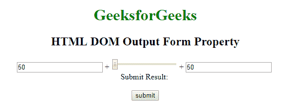
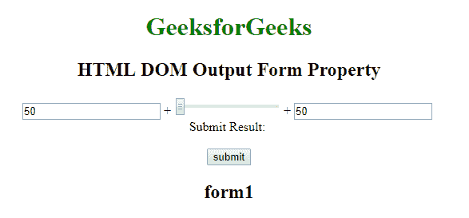

# HTML | DOM 输出表单属性

> 原文:[https://www . geesforgeks . org/html-DOM-output-form-property/](https://www.geeksforgeeks.org/html-dom-output-form-property/)

HTML DOM 中的**输出表单属性**用于返回对<输出>元素所属表单的引用。成功时返回表单对象的是只读属性。

**语法:**

```html
outputObject.form 
```

**注意:**HTML DOM 输出表单属性中没有属性值。

**返回值:**对<的引用形成包含<输出>元素的>元素。如果<输出>元素不在表单中，则返回空值

**示例:**

```html
<!DOCTYPE html>
<html>

<head>
    <title>HTML DOM output form Property </title>
    <style>
        body {
            text-align: center;
        }

        h1 {
            color: green;
        }
    </style>
</head>

<body>
    <h1>GeeksforGeeks</h1>
    <h2>HTML DOM Output Form Property</h2>
    <form id="form1" oninput="sumresult.value = parseInt(A.value) 
                + parseInt(B.value) + parseInt(C.value)">
        <input type="number" name="A" value="50" /> +
        <input type="range" name="B" value="0" /> +
        <input type="number" name="C" value="50" />
        <br /> Submit Result:
        <output id="geeks" name="sumresult" for="A B C"></output>
        <br>
        <br>

    </form>
    <button onclick="myGeeks()">submit</button>
    <h2 id="sudo"></h2>
    <script>
        function myGeeks() {
            var g = document.getElementById("geeks").form.id;
            document.getElementById("sudo").innerHTML = g;
        }
    </script>

</body>

</html>
```

*   点击按钮前:
    
*   点击按钮后:
    

**支持的浏览器:***HTML DOM 输出表单属性*支持的浏览器如下:

*   谷歌 Chrome
*   微软公司出品的 web 浏览器
*   火狐浏览器
*   歌剧
*   旅行队