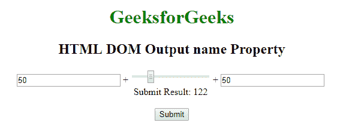
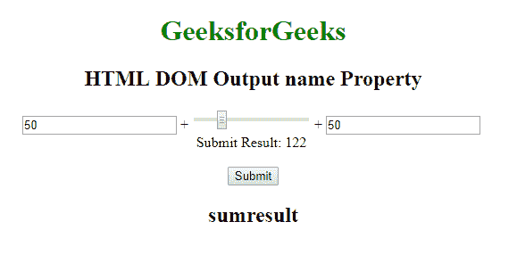
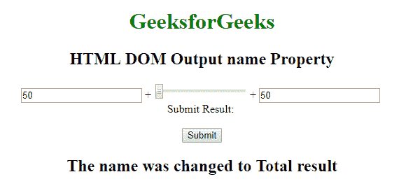

# HTML | DOM 输出名称属性

> 原文:[https://www . geesforgeks . org/html-DOM-output-name-property/](https://www.geeksforgeeks.org/html-dom-output-name-property/)

HTML DOM 中的**输出名称属性**用于设置或返回<输出>元素的名称属性的值。**名称**属性用于在提交表单后引用表单数据或引用 JavaScript 中的元素。

**语法:**

*   它返回名称属性。

    ```html
    outputObject.name 
    ```

*   它设置了 name 属性。

    ```html
    outputObject.name = name 
    ```

**属性值:**包含值**名称**，指定输出元素的名称。

**返回值:**返回指定输出元素名称的字符串值。

**示例 1:** 本示例返回输出名称属性。

```html
<!DOCTYPE html>
<html>

<head>
    <title>
        HTML DOM Output name Property
    </title>
    <style>
        body {
            text-align: center;
        }

        h1 {
            color: green;
        }
    </style>
</head>

<body>
    <h1>GeeksforGeeks</h1>
    <h4> 
      HTML DOM Output name Property 
    </h4>
    <form oninput="sumresult.value = parseInt(A.value) 
                + parseInt(B.value) + parseInt(C.value)">
        <input type="number" name="A" value="50" /> +

        <input type="range" name="B" value="0" /> +

        <input type="number" name="C" value="50" />
        <br /> Submit Result:
        <output name="sumresult" id="geeks" for="A B C">
        </output>
        <br>
        <br>
    </form>
    <Button onclick="myGeeks()">Submit</Button>
    <h2 id="sudo"></h2>

    <script>
        function myGeeks() {
            var x = document.getElementById("geeks").name;
            document.getElementById("sudo").innerHTML = x;
        }
    </script>

</body>

</html>
```

**输出:**

*   点击按钮前:
    
*   点击按钮后:
    

**示例 2:** 本示例设置输出名称属性。

```html
<!DOCTYPE html>
<html>

<head>
    <title>
        HTML DOM Output name Property
    </title>
    <style>
        body {
            text-align: center;
        }

        h1 {
            color: green;
        }
    </style>
</head>

<body>
    <h1>GeeksforGeeks</h1>
    <h4> 
     HTML DOM Output name Property 
    </h4>
    <form oninput="sumresult.value = parseInt(A.value) 
                + parseInt(B.value) + parseInt(C.value)">
        <input type="number" name="A" value="50" /> +

        <input type="range" name="B" value="0" /> +

        <input type="number" name="C" value="50" />
        <br /> Submit Result:
        <output name="sumresult" id="geeks" for="A B C">
        </output>
        <br>
        <br>
    </form>
    <Button onclick="myGeeks()">Submit</Button>
    <h2 id="sudo"></h2>

    <script>
        function myGeeks() {
            var x = document.getElementById("geeks").name =
                "Total result";
            document.getElementById("sudo").innerHTML =
              "The name was changed to " + x;
        }
    </script>

</body>

</html>
```

**输出:**

*   点击按钮前:
    
*   点击按钮后:
    

**支持的浏览器:***HTML DOM 输出名称属性*支持的浏览器如下:

*   谷歌 Chrome 10.0
*   Firefox 4.0
*   Opera 11.0
*   Safari 5.1