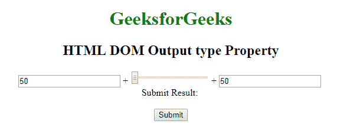
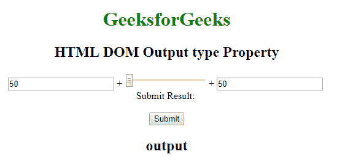

# HTML | DOM 输出类型属性

> 原文:[https://www . geesforgeks . org/html-DOM-output-type-property/](https://www.geeksforgeeks.org/html-dom-output-type-property/)

**HTML DOM 输出类型属性**用于返回输出元素的类型，输出对象代表的元素类型。此属性将始终返回“输出”。

**语法:**

```html
outputObject.type 
```

**参数:**该属性不接受任何参数。
**返回值:**返回一个字符串值，代表输出元素所属的 HTML 元素类型。

**示例:**本示例返回输出类型属性。

```html
<!DOCTYPE html>
<html>

<head>
    <title>
        HTML DOM Output type Property
    </title>
    <style>
        body {
            text-align: center;
        }

        h1 {
            color: green;
        }
    </style>
</head>

<body>
    <h1>GeeksforGeeks</h1>
    <h2> 
     HTML DOM Output type Property 
    </h2>
    <form oninput="sumresult.value = parseInt(A.value) 
                + parseInt(B.value) + parseInt(C.value)">
        <input type="number" name="A" value="50" /> +

        <input type="range" name="B" value="0" /> +

        <input type="number" name="C" value="50" />
        <br /> Submit Result:
        <output name="sumresult" id="geeks" for="A B C">
        </output>
        <br>
        <br>
    </form>
    <Button onclick="myGeeks()">Submit</Button>
    <h2 id="sudo"></h2>

    <script>
        function myGeeks() {
            var x = document.getElementById("geeks").type;
            document.getElementById("sudo").innerHTML = x;
        }
    </script>

</body>

</html>
```

**输出:**

*   点击按钮前:
    
*   点击按钮后:
    

**支持的浏览器:***HTML DOM 输出类型属性*支持的浏览器如下:

*   谷歌 Chrome 10.0
*   Firefox 4.0
*   Opera 11.0
*   Safari 5.1