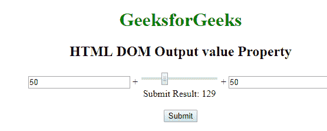
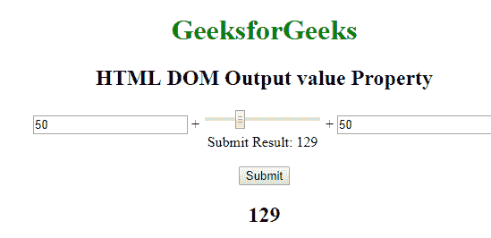
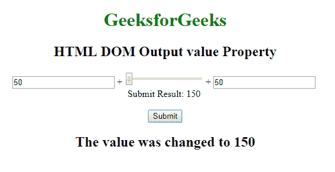

# HTML | DOM 输出值属性

> 原文:[https://www . geesforgeks . org/html-DOM-output-value-property/](https://www.geeksforgeeks.org/html-dom-output-value-property/)

**HTML DOM 输出值属性**用于设置或返回<输出>元素的属性值。**值**属性用于指定计算结果。

**语法:**

*   它返回 value 属性。

    ```html
    outputObject.value 
    ```

*   它设置了 value 属性。

    ```html
    outputObject.value = result 
    ```

**属性值:**包含指定计算结果的值，即**结果**。

**返回值:**返回代表计算结果的字符串值。

**示例 1:** 本示例返回属性值。

```html
<!DOCTYPE html>
<html>

<head>
    <title>
        HTML DOM Output value Property
    </title>
    <style>
        body {
            text-align: center;
        }

        h1 {
            color: green;
        }
    </style>
</head>

<body>
    <h1>GeeksforGeeks</h1>
    <h2> 
     HTML DOM Output value Property 
    </h2>
    <form oninput="sumresult.value = parseInt(A.value) 
                + parseInt(B.value) + parseInt(C.value)">
        <input type="number" name="A" value="50" /> +

        <input type="range" name="B" value="0" /> +

        <input type="number" name="C" value="50" />
        <br /> Submit Result:
        <output name="sumresult" id="geeks" for="A B C">
        </output>
        <br>
        <br>
    </form>
    <Button onclick="myGeeks()">Submit</Button>
    <h2 id="sudo"></h2>

    <script>
        function myGeeks() {
            var x = document.getElementById("geeks").value;
            document.getElementById("sudo").innerHTML = x;
        }
    </script>

</body>

</html>
```

**输出:**

*   点击按钮前:
    
*   点击按钮后:
    

**示例 2:** 本示例设置值属性。

```html
<!DOCTYPE html>
<html>

<head>
    <title>
        HTML DOM Output value Property
    </title>
    <style>
        body {
            text-align: center;
        }

        h1 {
            color: green;
        }
    </style>
</head>

<body>
    <h1>GeeksforGeeks</h1>
    <h2> 
     HTML DOM Output value Property 
    </h2>
    <form oninput="sumresult.value = parseInt(A.value) 
                + parseInt(B.value) + parseInt(C.value)">
        <input type="number" name="A" value="50" /> +

        <input type="range" name="B" value="0" /> +

        <input type="number" name="C" value="50" />
        <br /> Submit Result:
        <output name="sumresult" id="geeks" for="A B C">
        </output>
        <br>
        <br>
    </form>
    <Button onclick="myGeeks()">Submit</Button>
    <h2 id="sudo"></h2>

    <script>
        function myGeeks() {
            var x = document.getElementById("geeks").value =
            150;
            document.getElementById("sudo").innerHTML = 
              "The value was changed to  " + x;
        }
    </script>

</body>

</html>
```

**输出:**

*   点击按钮前:
    
*   点击按钮后:
    

**支持的浏览器:***HTML DOM 输出值属性*支持的浏览器如下:

*   google chrome 10.0
*   Firefox 4.0
*   Opera 11.0
*   Safari 5.1