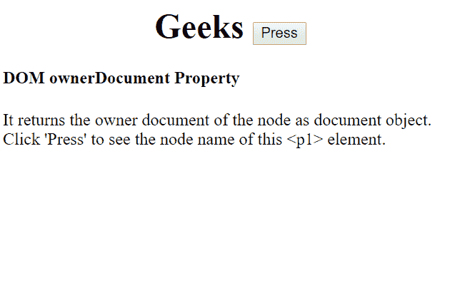
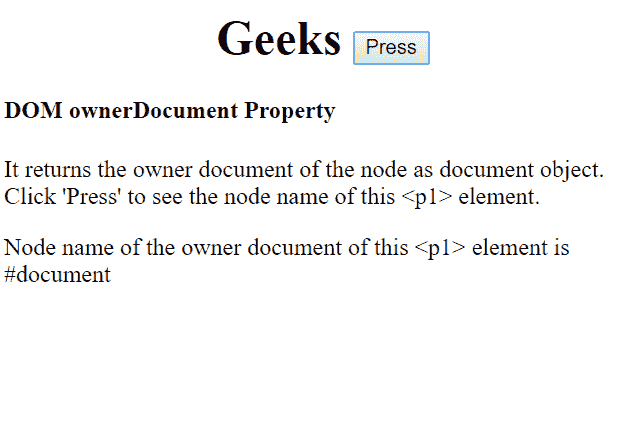
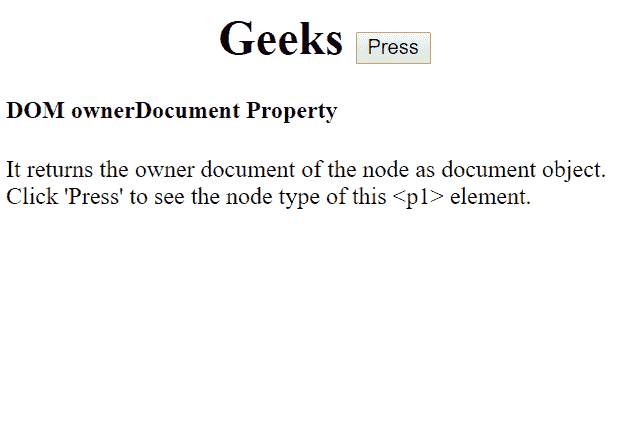
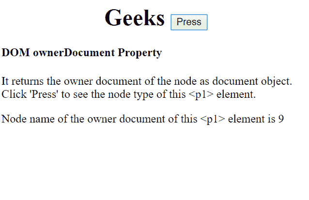

# HTML | DOM 所有者文档属性

> 原文:[https://www . geesforgeks . org/html-DOM-ownerdocument-property/](https://www.geeksforgeeks.org/html-dom-ownerdocument-property/)

**ownerDocument** 属性返回节点的顶层文档对象。这里，节点的所有者文档作为文档对象返回。它是只读属性。

**语法:**

```html
node.ownerDocument;
```

**属性:**

1.  **nodeName 属性:**返回指定节点的名称。如果节点是元素节点，它将返回标记名 else 如果节点是属性节点，它将返回属性名 else 对于不同的节点类型，将返回不同的名称。

**语法:**

```html
node.ownerDocument.nodeName;
```

**返回值:**节点的所有者文档，作为文档对象返回。

**示例 1:显示节点名称属性**

```html
<!DOCTYPE html>
<html>

<body>

    <h1><center>Geeks <button onclick="node()">
      Press
      </button>
      </center>
  </h1>

    <h4>DOM ownerDocument Property</h4>
    <p>It returns the owner document of the node 
      as document object. Click 'Press' to see the
      node name of this <p1> element.</p>

    <p1 id="PP"></p1>
    <p1 id="p2"></p1>
    <p1 id="pl"></p1>

    <script>
        function node() {

            var x = document.getElementById(
             "PP").ownerDocument.nodeName;
            document.getElementById("p2").innerHTML = 
              "Node name of the owner document "+
              "of this <p1> element  is";

            document.getElementById("pl").innerHTML = x

        }
    </script>

</body>

</html>
```

**输出:**

*   **点击按钮前:**
    
*   **点击按钮后:**
    

*   **nodeType property:** It returns the node type, as a number, of the specified node.
    Eg: 1 is returned for an element node and
    2 is returned for attribute node.

    **语法:**

    ```html
    node.ownerDocument.nodeType;
    ```

    **返回值:**节点的所有者文档，作为文档对象返回。

    **示例-2:显示节点类型属性**

    ```html
    <!DOCTYPE html>
    <html>

    <body>

        <h1><center>Geeks <button onclick="node()">
          Press
          </button>
          </center> 
      </h1>

        <h4>DOM ownerDocument Property</h4>
        <p>It returns the owner document of the node
          as document object. Click 'Press' to see 
          the node type of this <p1> element.
      </p>

        <p1 id="PP"></p1>
        <p1 id="p2"></p1>
        <p1 id="pl"></p1>

        <script>
            function node() {

                var x = document.getElementById(
                  "PP").ownerDocument.nodeType;

                document.getElementById("p2").innerHTML = 
                  "Node name of the owner document "+
                  "of this <p1> element  is";

                document.getElementById("pl").innerHTML = x

            }
        </script>

    </body>

    </html>
    ```

    **输出:**

    *   **点击按钮前:**
        
    *   **点击按钮后:**
        

    **浏览器支持:**T2 DOM ownerDocument 属性支持的浏览器如下:

    *   谷歌 Chrome
    *   微软公司出品的 web 浏览器
    *   火狐浏览器
    *   歌剧
    *   旅行队