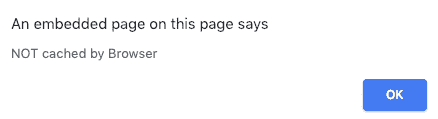

# html | DOM page transition event

> 哎哎哎:# t0]https://www . geeksforgeeks . org/html-DOM-page transition event/

**页面转移事件**发生在加载或卸载文档期间。

**语法:**

```html
PageTransitionEvent.persisted
```

**属性值:**

*   **持久化:**返回是否缓存网页的布尔值。

**返回值:**如果文档是从缓存中加载的，则该属性返回真，否则返回假。

**示例:**

```html
<!DOCTYPE html>
<html>

<body bgcolor="green" onpageshow="myFunction(event)">
    <center>
        <h1 style="color:white;">GeeksforGeeks</h1>
        <p id="demo" style="color:white;"></p>
    </center>
    <script>
        function myFunction(event) {

            // Check page was cached by the browser
            // or not.
            if (event.persisted) {
                alert("Cached by Browser");
            } else {
                alert("NOT cached by Browser");
            }
        }
    </script>
</body>

</html>
```

**输出:**


**支持的浏览器:**

*   谷歌 Chrome
*   火狐浏览器
*   边缘
*   旅行队
*   歌剧