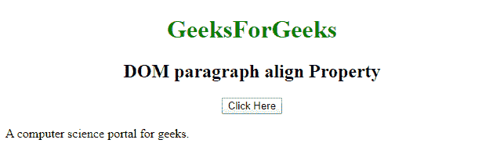
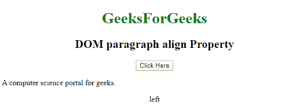
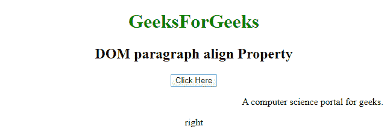

# HTML | DOM 段落对齐属性

> 原文:[https://www . geesforgeks . org/html-DOM-段落-align-property/](https://www.geeksforgeeks.org/html-dom-paragraph-align-property/)

**HTML DOM 段落对齐属性**用于设置或返回 **< p >** 元素的对齐属性的值。
**语法:**

*   它返回段落对齐属性。

```html
P object.align;
```

*   它设置段落对齐属性。

```html
p objectobject.align="left | right | center"
```

**房产价值:**

*   **左:**设置左对齐段落。
*   **居中:**设置段落居中对齐。
*   **右:**设置段落右对齐。

**返回值:**返回一个代表段落元素对齐方式的字符串值。
**示例 1:** 本示例返回段落对齐属性。

## 超文本标记语言

```html
<!DOCTYPE html>
<html>

<head>
    <title>
        HTML DOM paragraph align property
    </title>
</head>

<body style="text-align:center;">

    <h1 style = "color:green;" >
        GeeksForGeeks
    </h1>

    <h2>DOM paragraph align Property </h2>

    <button onclick="Geeks()">
        Click Here
    </button>

    <p id="s" align="left">
        A computer science portal for geeks.
    </p>

    <p id="geeks"></p>

    <script>
        function Geeks() {
            var txt = document.getElementById("s").align;

            document.getElementById(
                    "geeks").innerHTML=txt;
        }
    </script>
</body>

</html>
```

**输出:**
**点击按钮前:**



**点击按钮后:**



**示例 2:** 本示例设置段落对齐属性。

## 超文本标记语言

```html
<!DOCTYPE html>
<html>

<head>
    <title>
        HTML DOM paragraph align property
    </title>
</head>

<body style="text-align:center;">

    <h1 style = "color:green;" >
        GeeksForGeeks
    </h1>

    <h2>DOM paragraph align Property</h2>

    <button onclick="Geeks()">
        Click Here
    </button>

    <p id="s" align="left">
        A computer science portal for geeks.
    </p>

    <p id="geeks"></p>

    <script>
        function Geeks() {
            var txt = document.getElementById(
                        "s").align = "right";

            document.getElementById(
                    "geeks").innerHTML = txt;
        }
    </script>
</body>

</html>
```

**输出:**
**点击按钮前:**


**点击按钮后:**



**支持的浏览器:**T2 DOM 段落对齐属性支持的浏览器如下:

*   谷歌 Chrome
*   微软公司出品的 web 浏览器
*   火狐浏览器
*   苹果 Safari
*   歌剧