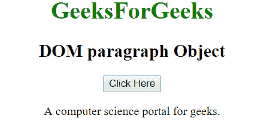
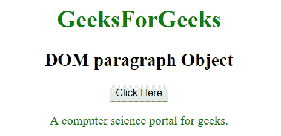
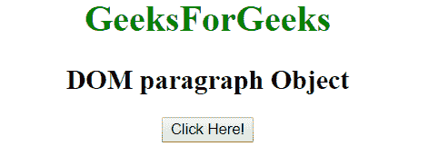
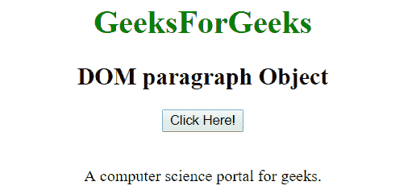

# HTML | DOM 段落对象

> 原文:[https://www.geeksforgeeks.org/html-dom-paragraph-object/](https://www.geeksforgeeks.org/html-dom-paragraph-object/)

**DOM 段落对象**用于表示 HTML < p >元素。p 元素由 **getElementById()** 访问。

**语法:**

```html
document.getElementById("id"); 
```

其中‘id’是分配给 **p** 标签的 ID。
下面的程序说明了 **p** 的对象:

**属性值**

*   [**对齐**](https://www.geeksforgeeks.org/?p=386712) **:** 用于设置或返回段落元素的对齐方式。

**示例-1:** 在下面的程序中，段落元素被分配了 id =“s”。点击按钮，段落元素被访问，段落文本的颜色被改变。

## 超文本标记语言

```html
<!DOCTYPE html>
<html>
<body>
    <center>
        <h1 style = "color:green;" >
          GeeksForGeeks
        </h1>
        <h2>DOM paragraph Object</h2>

        <button onclick="Geeks()">Click Here</button>

        <p id="s">A computer science 
        portal for geeks.</p>

        <script>
        function Geeks() {
          var txt = document.getElementById("s");
          txt.style.color = "green";
        }
        </script>
</body>
</html>
```

**输出:**
**点击按钮前:**



**点击按钮后:**



**示例-2:** 可以使用 **document.createElement** 方法创建段落对象。在下面的程序中，我们创建了一个段落元素，并在其中添加了一个文本节点。

## 超文本标记语言

```html
<!DOCTYPE html>
<html>
<body>
<center>
        <h1 style = "color:green;" >
          GeeksForGeeks
        </h1>

        <h2>DOM paragraph Object</h2>

        <button onclick="Geeks()">Click Here!</button><br><br>

        <div id="p"></div>

        <script>
        function Geeks() {
          var txt = document.createElement("P");

          var t = document.createTextNode("A computer
                               science portal for geeks.");

          txt.appendChild(t);

          document.getElementById("p").appendChild(txt);
        }
        </script>
</body>
</html>
```

**输出:**
**点击按钮前:**



**点击按钮后:**



**支持的浏览器:**

*   谷歌 Chrome
*   Mozilla Firefox
*   边缘
*   旅行队
*   歌剧