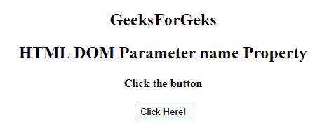
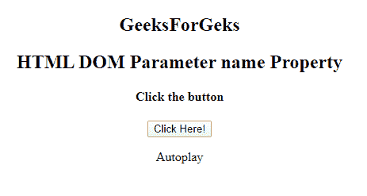

# HTML | DOM 参数名属性

> 原文:[https://www . geesforgeks . org/html-DOM-parameter-name-property/](https://www.geeksforgeeks.org/html-dom-parameter-name-property/)

**HTML DOM 参数名称属性**用于设置或返回参数的名称属性。**名称**属性用于在提交表单后引用表单数据或引用 JavaScript 中的元素。
**语法:**

*   它返回名称属性。

```html
parameterObject.name 
```

*   它用于设置 name 属性。

```html
parameterObject.name = name 
```

**属性值:**接受单个参数名称，并指定参数元素的名称
**返回值:**返回代表参数元素名称的字符串值。
**示例:**这个程序说明了如何返回 Property 这个名字。

## 超文本标记语言

```html
<!DOCTYPE html>
<html>
<title>
    HTML DOM Parameter name Property
</title>

<body>
    <center>
        <h2>
    GeeksForGeks
</h2>
        <h2>
    HTML DOM Parameter name Property
</h2>
        <h4>Click the button</h4>
        <button onclick="GFG()">Click Here!
            <br>
        </button>

<p></p>

        <object data="sample.mp4">
            <param id="myParam"
                   name="Autoplay"
                   value="true">
        </object>
        <p id="Geeks"></p>

        <script>
            function GFG() {
                var x =
                    document.getElementById("myParam").name;
                document.getElementById(
                  "Geeks").innerHTML = x;
            }
        </script>
    </center>
</body>

</html>
```

**输出:**
**之前点击**
按钮



**点击**按钮后



**支持的浏览器:****DOM 参数名属性**支持的浏览器如下:

*   谷歌 Chrome
*   微软公司出品的 web 浏览器
*   火狐浏览器
*   苹果 Safari
*   歌剧