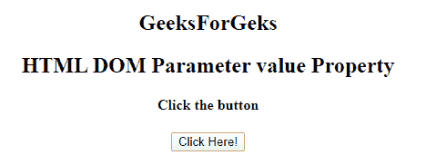
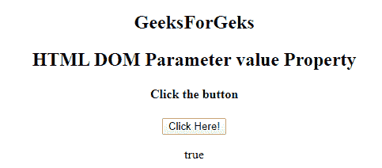

# HTML | DOM 参数值属性

> 原文:[https://www . geesforgeks . org/html-DOM-parameter-value-property/](https://www.geeksforgeeks.org/html-dom-parameter-value-property/)

**HTML DOM 参数值属性**用于设置或返回参数的值属性的值，但是，值属性的内容不会显示给用户。当用户提交表单时，该值和其他信息被发送到服务器。但是当复选框处于未选中状态时，将不会发送任何信息。
**语法:**

*   它返回值属性:

```html
parameterObject.value 
```

*   它用于设置 value 属性。

```html
parameterObject.value = value 
```

**属性值**它包含单值文本，用于指定与参数相关的值。
**返回值:**返回一个字符串值，代表一个参数的值属性的值。
**示例 1:** 本示例返回参数值属性。

## 超文本标记语言

```html
<!DOCTYPE html>
<html>
    <title>
        HTML DOM Parameter value Property
    </title>
<body>
     <center>
<h2>
    GeeksForGeks
</h2>
<h2>
    HTML DOM Parameter value Property
</h2>
    <h4>Click the button</h4>
    <button onclick="GFG()">Click Here!<br>
    </button>

<p></p>

        <object data="sample.mp4">
            <param id="myParam" name="Autoplay" value="true">
        </object>
    <p id="Geeks"></p>

    <script>
        function GFG() {
                var x = document.getElementById("myParam").value;
        document.getElementById("Geeks").innerHTML = x;
        }
    </script>
    </center>
</body>
</html>
```

**输出:**
**点击按钮前:**



**点击按钮后:**



**支持的浏览器:****DOM 参数值属性**支持的浏览器如下:

*   谷歌 Chrome
*   微软公司出品的 web 浏览器
*   火狐浏览器
*   苹果 Safari
*   歌剧