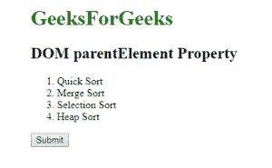
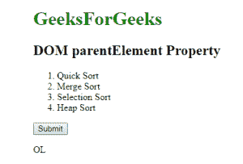
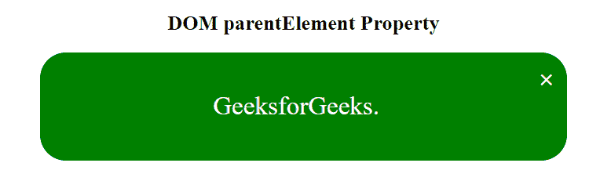
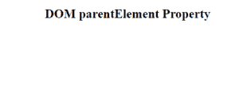

# HTML | DOM parentElement 属性

> 原文:[https://www . geesforgeks . org/html-DOM-parent element-property/](https://www.geeksforgeeks.org/html-dom-parentelement-property/)

**DOM parentElement 属性**用于返回特定子元素的父元素。它是只读属性。父元素和父节点属性相似，唯一的区别是如果父节点不是元素，父元素属性返回空值。

**语法:**

```html
node.parentElement
```

**返回值:**返回一个代表任何子节点的父节点的字符串，如果指定的节点不包含任何父节点，则返回空值。

**例 1:**

```html
<!DOCTYPE html>
<html>
    <head>
        <title>
            HTML DOM parentElement Property
        </title>
    </head>

    <body>
        <h1 style = "color:green;">
            GeeksForGeeks
        </h1>

        <h2>DOM parentElement Property</h2>

        <ol type = "1">
            <li id = "GFG">Quick Sort</li>
            <li>Merge Sort</li>
            <li>Selection Sort</li>
            <li>Heap Sort</li>
        </ol>

        <button onclick="Geeks()">
            Submit
        </button>

        <p id="sudo"></p>

        <!-- script to find parentElement -->
        <script>
            function Geeks() {
            var w = 
                document.getElementById("GFG").parentElement.nodeName;
            document.getElementById("sudo").innerHTML = w;
            }
        </script>
    </body>
</html>                    
```

**输出:**
**之前点击按钮:**

**之后点击按钮:**


**示例 2:** 本示例隐藏父元素以点击关闭图标。

```html
<!DOCTYPE html>
<html>
    <head>
        <title>
            HTML DOM parentElement Property
        </title>

        <!-- CSS property to create box-->
        <style>
            div {
                padding: 16px;
                width: 70%;
                background-color: green;
                color: white;
                border-radius:30px;
            }
            .GFG {
                float: right;
                font-size: 30px;
                font-weight: bold;
                cursor: pointer;
            }
        </style>
    </head>

    <body>
        <center>
            <h2>DOM parentElement Property</h2>

            <div>
                <span class = "GFG"
                      onclick = "this.parentElement.style.display
                              = 'none';">
                 ×
                </span>

                <p style="font-size:30px;">GeeksforGeeks.</p>
            </div>
        </center>
    </body>
</html>                    
```

**输出:**
**点击十字图标前:**

**点击十字图标后:**

**支持的浏览器:**DOM parent element 属性支持的浏览器如下:

*   谷歌 Chrome 1.0
*   微软公司出品的 web 浏览器
*   Firefox 9.0
*   歌剧
*   旅行队