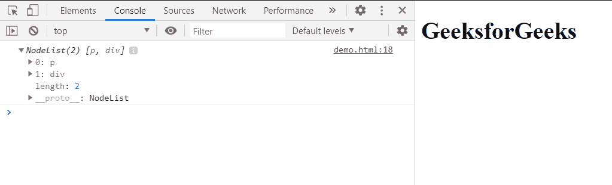

# HTML DOM ParentNode.append()方法

> 原文:[https://www . geesforgeks . org/html-DOM-parent node-append-method/](https://www.geeksforgeeks.org/html-dom-parentnode-append-method/)

**ParentNode.append()** 方法用于在 ParentNode 的最后一个子节点后插入 **Node** 对象或 **DOMString** 对象。**多字符串**对象作为文本节点插入。

**语法:**

```html
ParentNode.append( ChildNodesToPrepend );
```

**参数:**此参数保存要作为父元素的最后一个子元素插入的节点或多字符串对象集。

以下示例说明了 ParentNode.append()方法:

**示例 1:** 在本例中，我们将追加一个元素。为了展示这个方法，我们创建了三个元素 parentNode，Child1 和 Child2。然后我们将子节点 1 和子节点 2 附加到父节点。

在控制台中，我们显示了父节点的子节点。

## 超文本标记语言

```html
<!DOCTYPE html>
<html lang="en">

<head>
    <meta charset="UTF-8">
</head>

<body>
    <h1>GeeksforGeeks</h1>

    <script>
        var parentNode = document.createElement("div");
        var Child1 = document.createElement("p");
        var Child2 = document.createElement("div");
        parentNode.append(Child1);
        parentNode.append(Child2);
        console.log(parentNode.childNodes); 
    </script>
</body>

</html>
```

**输出:**

在控制台中，可以看到**父节点**的**子节点列表**。一个是 **p** 一个是 **div。**



**示例 2:** 在这个示例中，我们已经向元素的内部 HTML 和元素的 textContent 追加了一些文本。

## 超文本标记语言

```html
<!DOCTYPE html>
<html lang="en">

<body>
    <h1>GeeksforGeeks</h1>

    <script>
        var parent = document.createElement("div");
        parent.innerHTML = "GeeksforGeeks : ";
        parent.append("A Computer Science Portal for Geeks");
        console.log(parent.textContent); 
    </script>
</body>

</html>
```

**输出:**

在控制台中，可以看到**父**元素的文本内容。


**支持的浏览器:**

*   谷歌 Chrome
*   边缘
*   火狐浏览器
*   苹果 Safari
*   歌剧