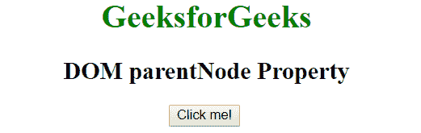
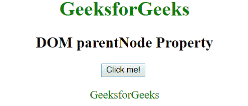

# HTML | DOM parentNode 属性

> 原文:[https://www.geeksforgeeks.org/html-dom-parentnode-property/](https://www.geeksforgeeks.org/html-dom-parentnode-property/)

**父节点**属性用于将指定节点的父节点作为节点对象返回。它是只读属性。

**语法:**

```html
node.parentNode
```

**返回值:**该属性返回指定节点的父元素，如果当前节点没有父元素，则返回 null。

**示例:**

```html
<!DOCTYPE html>
<html>

<head>
    <title>
      DOM parentNode Property
    </title>
</head>

<body onload="start ()" style="text-align: center">
    <h1 style="color:green">
        GeeksforGeeks
    </h1>

    <h2>
        DOM parentNode Property
    </h2>

    <button onclick="geek ()">Click me!</button>
    <br>
    <br>
    <div id="container">
    </div>
    <script>
        var Text = null;

        // function to call on body load
        function start() {
            // creating a span element
            Text = document.createElement("span");
            Text.style.color = "green";
            Text.innerHTML = "GeeksforGeeks";
        }

        // check function
        function geek() {
            var container = 
                document.getElementById("container");
            // checking if parent node of Text 
            // matches with that of var container 
            if (Text.parentNode === container) {
                container.removeChild(Text);
            } else {
                container.appendChild(Text);
            }
        }
    </script>
</body>

</html>
```

**输出:**
**点击按钮前:**

**点击按钮后:**

再次点击按钮隐藏文字。

**支持的浏览器:**由*父节点属性*支持的浏览器如下:

*   谷歌 Chrome 1.0
*   微软公司出品的 web 浏览器
*   Firefox 1.0
*   歌剧
*   旅行队