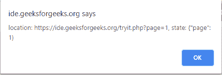
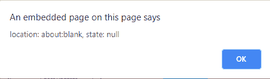

# HTML | DOM 流行病学事件

> 哎哎哎:# t0]https://www . geeksforgeeks . org/html-DOM-pops statement event/

**HTML DOM popstatevent**是窗口上 popstate 事件的事件处理程序。每当活动历史条目在同一文档的两个历史条目之间改变时，popstate 事件被分派到窗口。

**属性:**

*   **state:** This property/method returns an object containing a copy of the history entries

    **事件类型:**

    *   **popstate:** This event occurs when the window’s history changes

    **示例:**

    ```html
    <!DOCTYPE html>
    <html>

    <body>
        <script>
            window.onpopstate = function(event) {
               alert("location: " + document.location +
               ", state: " + JSON.stringify(event.state));
            };
            history.pushState({
                page: 1
            }, "title 1", "?page=1");
            history.pushState({
                page: 2
            }, "title 2", "?page=2");
            history.replaceState({
                page: 3
            }, "title 3", "?page=3");

            // alerts "location: 
            // https://ide.geeksforgeeks.org/tryit.php?page=1,
            // state: {"page":1}"
            history.back();

            // alerts "location: about:blank, state: null"
            history.back();
        </script>
    </body>

    </html>
    ```

    **输出:**
    
    

    **支持的浏览器:**

    *   谷歌 Chrome
    *   Mozilla Firefox
    *   歌剧
    *   边缘
    *   旅行队