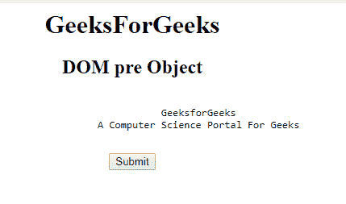
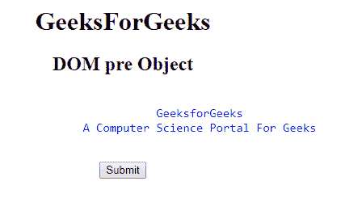
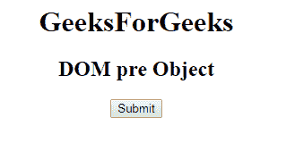
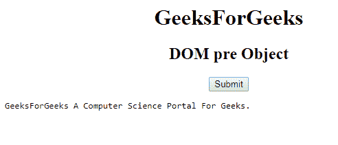

# HTML | DOM 前置对象

> 原文:[https://www.geeksforgeeks.org/html-dom-pre-object/](https://www.geeksforgeeks.org/html-dom-pre-object/)

**DOM 前置对象**用于表示 HTML [<前置>](https://www.geeksforgeeks.org/html-pre-tag/) 元素。通过 **getElementById()** 访问 *pre* 元素。
**属性:**

*   [**<u>宽度:</u>**](https://www.geeksforgeeks.org/html-dom-pre-width-property/) 用于设置或返回前置元素的宽度属性的值。

**语法:**

```html
document.getElementById("ID");
```

其中**“id”**是分配给**“pre”**标签的 ID。
**例-1:**

## 超文本标记语言

```html
<!DOCTYPE html>
<html>

<head>
    <title>DOM pre Object</title>
</head>

<body>
    <center>
        <h1>GeeksForGeeks</h1>
        <h2>DOM pre Object</h2>

        <!-- Assigning id to pre tag -->
        <pre id="GFG">
            GeeksforGeeks
            A Computer Science Portal For Geeks
        </pre>

        <button onclick="myGeeks()">
          Submit
        </button>

        <script>
            function myGeeks() {

                //  Accessing pre tag.
                var g = document.getElementById("GFG");
                g.style.color = "blue";
                g.style.fontSize = "15px";
            }
        </script>
  </center>
</body>

</html>
```

**输出:**
**点击按钮前:**



**点击按钮后:**



**示例-2 :** 可以使用**文档创建元素方法创建预对象。**

## 超文本标记语言

```html
<!DOCTYPE html>
<html>

<head>
    <title>DOM pre Object</title>
</head>

<body>
    <center>
        <h1>GeeksForGeeks</h1>
        <h2>DOM pre Object</h2>
        <button onclick="myGeeks()">Submit</button>

      <script>

          function myGeeks() {

              //  Creating 'pre' object.
              var g = document.createElement("PRE");

              var f =
                 document.createTextNode("GeeksForGeeks"
                 +"A Computer Science Portal For Geeks.");
                g.appendChild(f);
                document.body.appendChild(g);
            }
        </script>
  </center>
</body>

</html>      
```

**输出:**
**点击按钮前:**



**点击按钮后:**



**支持的浏览器:****DOM Pre Object**支持的浏览器如下:

*   谷歌 Chrome
*   微软公司出品的 web 浏览器
*   火狐浏览器
*   歌剧
*   旅行队