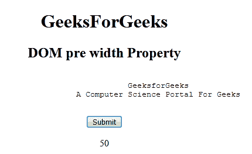
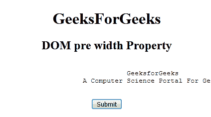
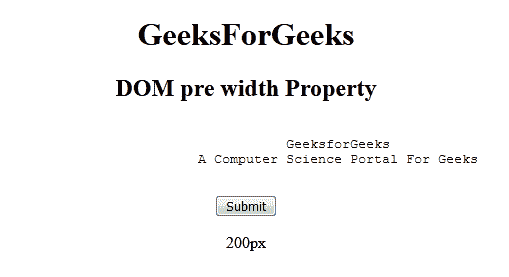

# HTML | DOM 预宽度属性

> 原文:[https://www.geeksforgeeks.org/html-dom-pre-width-property/](https://www.geeksforgeeks.org/html-dom-pre-width-property/)

**HTML DOM 预宽度属性**用于设置或返回<预>元素的宽度属性值。
**语法:**

*   它返回一个预宽度属性。

```html
preObject.width
```

*   它用于设置预宽度属性。

```html
preObject.width = "pixel";
```

**房产价值:**

*   **像素:**以像素为单位设置预定文本的宽度。
*   **%:** 以百分比(%)设置预定文本的宽度。

**返回值:**返回一个代表 **<前置>** 元素宽度的数值。
**示例 1:** 本示例返回前置元素的宽度属性。

## 超文本标记语言

```html
<!DOCTYPE html>
<html>

<head>
    <title>DOM pre width Property</title>
</head>

<body>
    <center>
        <h1>GeeksForGeeks</h1>
        <h2>DOM pre width Property</h2>

        <!-- Assigning id to pre tag -->
        <pre id="GFG" width="50%">
            GeeksforGeeks
            A Computer Science Portal For Geeks
        </pre>

        <button onclick="myGeeks()">
            Submit
        </button>

        <p id="sudo"></p>

        <script>
            function myGeeks() {

                // Accessing pre tag.
                var g = document.getElementById(
                            "GFG").width;

                document.getElementById(
                        "sudo").innerHTML = g;
            }
        </script>
    </center>
</body>

</html>
```

**输出:**

*   **点击按钮前:**


*   **点击按钮后:**



**示例 2:** 下面的代码用于设置预宽度属性。

## 超文本标记语言

```html
<!DOCTYPE html>
<html>

<head>
    <title>DOM pre width Property</title>
</head>

<body>
    <center>
        <h1>GeeksForGeeks</h1>
        <h2>DOM pre width Property</h2>

        <!-- Assigning id to pre tag -->
        <pre id="GFG" width="50%">
            GeeksforGeeks
            A Computer Science Portal For Geeks
        </pre>

        <button onclick="myGeeks()">
            Submit
        </button>

        <p id="sudo"></p>

        <script>
            function myGeeks() {

                // Accessing pre tag.
                var g = document.getElementById(
                            "GFG").width = "200px";

                document.getElementById(
                        "sudo").innerHTML = g;
            }
        </script>
    </center>
</body>

</html>
```

**输出:**

*   **点击按钮前:**



*   **点击按钮后:**

