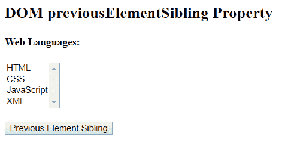
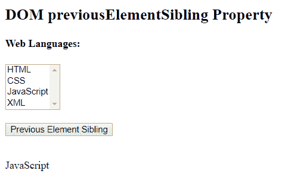

# HTML | DOM previouselementsible 属性

> 原文:[https://www . geeksforgeeks . org/html-DOM-previouselementsibling-property/](https://www.geeksforgeeks.org/html-dom-previouselementsibling-property/)

HTML DOM 中的**previouselementsible 属性**用于返回给定元素的同一级别的前一个元素。如果在同一级别上没有找到以前的元素，则返回 null。它是只读属性。它类似于 previousSibling 属性，但不同之处在于 previousSibling 属性将前一个同级节点作为元素节点、文本节点或注释节点返回，而 previousElementSibling 属性将前一个同级节点作为元素节点返回。

**语法:**

```html
node.previousElementSibling
```

**返回值:**此属性返回指定元素的前一个同级，如果当前元素没有前一个同级，则返回 null。

**示例:**

```html
<!DOCTYPE html>
<html>
    <head>
        <title>
            HTML DOM previousElementSibling Property
        </title>
    </head>

    <body>

        <h2>
            DOM previousElementSibling Property
        </h2>

        <h4 id = "h42">Web Languages:</h4>

        <select size = "4">
            <option>HTML</option>
            <option>CSS</option>
            <option>JavaScript</option>
            <option id = "Select">XML</option>
        </select>
        <br><br>

        <button onclick = "Geeks()">
            Previous Element Sibling
        </button>

        <br><br>

        <p id = "p"></p>

        <script>
        function Geeks() {
            var a = 
            document.getElementById("Select").previousElementSibling;

            document.getElementById("p").innerHTML = a.text;
        }
        </script>
    </body>
</html>                    
```

**输出:**
**之前点击按钮:**

**之后点击按钮:**


**注意:**两个兄弟元素之间不要用空格，否则结果会是“未定义”。

**支持的浏览器:**T2 DOM previouselementsible 属性支持的浏览器如下:

*   谷歌 Chrome 2.0
*   Internet Explorer 9.0
*   Firefox 3.5
*   opera10.0
*   Safari 4.0