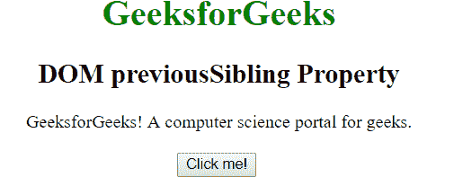
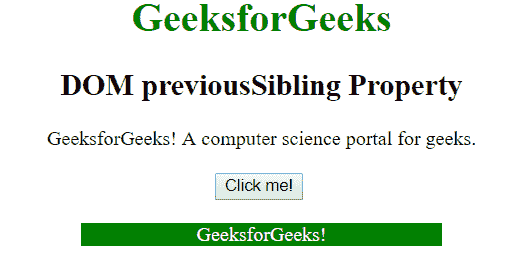

# HTML | DOM 前置兄弟属性

> 原文:[https://www . geesforgeks . org/html-DOM-previoussibling-property/](https://www.geeksforgeeks.org/html-dom-previoussibling-property/)

**previoussible**属性用于将指定节点的上一个节点作为 node 对象返回，如果指定节点是列表中的第一个节点，则返回 null。它是只读属性。
**语法:**

```html
node.previousSibling

```

**返回值:**此属性返回指定节点的前一个同级，如果当前节点没有前一个同级，则返回 null。
T3】例:

```html
<html>
    <head>
       <title>DOM previousSibling Property</title>
    </head>
    <body style = "text-align: center">
        <h1 style = "color:green">
            GeeksforGeeks
        </h1>

        <h2>
            DOM previousSibling Property
        </h2>

        <div>
            <span id="p1">GeeksforGeeks! </span><span id="p2">
               A computer science portal for geeks.
            </span>
        </div>
        <br>

        <button onclick="geek()">Click me!</button>
        <br><br>
        <p id="p" style = "margin:auto; width: 40%"></p>

        <!-- Function to return the previous node.-->

        <script>
        function geek() {
          var x = 
              document.getElementById("p2").previousSibling.innerHTML; 
          document.getElementById("p").innerHTML = x;
          document.getElementById("p").style.color = "white";
          document.getElementById("p").style.background = "green";
        }
        </script>
    </body>
</html>
```

**输出:**
点击按钮前:

点击按钮后:


**注意:**不要在两个兄弟元素之间放空白，否则结果会是“未定义”。

**支持的浏览器:**由*先前的兄弟属性*支持的浏览器如下:

*   谷歌 Chrome
*   微软公司出品的 web 浏览器
*   火狐浏览器
*   歌剧
*   旅行队