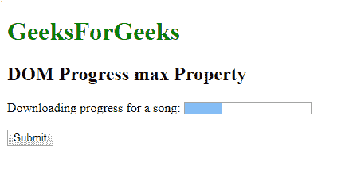
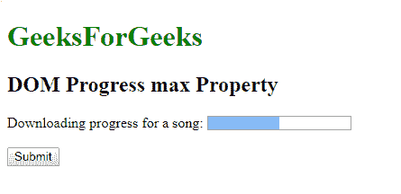
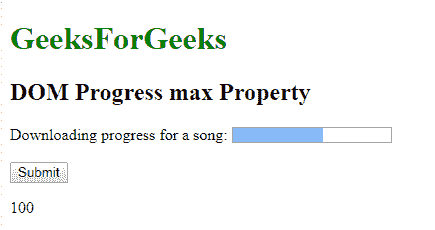

# HTML | DOM 进度最大属性

> 原文:[https://www . geesforgeks . org/html-DOM-progress-max-property/](https://www.geeksforgeeks.org/html-dom-progress-max-property/)

**DOM Progress max 属性**用于设置或返回 [< progress >](https://www.geeksforgeeks.org/?p=235125) 元素的 max 属性的值。max 属性表示完成一项任务需要完成的总工作量。

**语法:**

*   它用于返回 progress max 属性。

```html
progressObject.max
```

*   它用于设置最大进度属性。

```html
progressObject.max = number
```

**属性值:**

*   **数字:**用数值表示已经完成的工作量。

**返回值:**返回一个浮点数，表示完成一项任务需要多少工作量。

**示例-1:** 本示例说明如何设置进度最大属性。

## 超文本标记语言

```html
<!DOCTYPE html>
<html>

<head>
    <title>
        HTML DOM Progress max Property
    </title>
</head>

<body>
    <h1 style="color:green;">
            GeeksForGeeks
        </h1>

    <h2>DOM Progress max Property </h2>
     Downloading progress for a song:
    <progress id="GFG" value="30" max="100">
    </progress>

    <br>
    <br>

    <button onclick="myGeeks()">
        Submit
    </button>

    <script>
        function myGeeks() {
            var pr = document.getElementById("GFG").max = "60";
        }
    </script>
</body>

</html>
```

**输出:**
**点击按钮前:**



**点击按钮后:**



**示例-2 :** 这个示例说明了如何返回 progress max 属性。

## 超文本标记语言

```html
<!DOCTYPE html>
<html>

<head>
    <title>
        HTML DOM Progress max Property
    </title>
</head>

<body>
    <h1 style="color:green;">
            GeeksForGeeks
        </h1>

    <h2>DOM Progress max Property </h2>
     Downloading progress for a song:
    <progress id="GFG" value="57" max="100">
    </progress>

    <br>
    <br>

    <button onclick="myGeeks()">
        Submit
    </button>

    <p id="sudo"></p>

    <script>
        function myGeeks() {
            var pr =
            document.getElementById("GFG").max;

            document.getElementById("sudo").innerHTML =
              pr;
        }
    </script>
</body>

</html>
```

**输出:**
**点击按钮前:**


**点击按钮后:**



**支持的浏览器:****DOM Progress max 属性**支持的浏览器如下:

*   谷歌 Chrome
*   微软公司出品的 web 浏览器
*   火狐浏览器
*   歌剧
*   旅行队