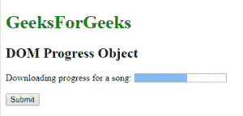
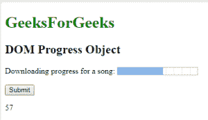
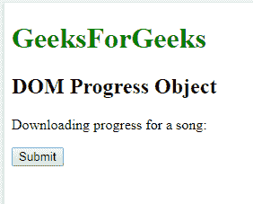
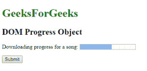

# HTML | DOM 进度对象

> 原文:[https://www.geeksforgeeks.org/html-dom-progress-object/](https://www.geeksforgeeks.org/html-dom-progress-object/)

HTML DOM 中的进度对象用来表示 HTML progress 元素。使用 getElementById()方法可以访问<progress>元素。
**房产价值:**</progress> 

*   **级:**返回进度条列表。
*   [**max:**](https://www.geeksforgeeks.org/html-dom-progress-max-property/?ref=rp) 用于设置或返回 max 属性的进度条值。
*   [**值**](https://www.geeksforgeeks.org/html-dom-progress-value-property/) **:** 它代表已经完成的工作量。
*   [**位置**](https://www.geeksforgeeks.org/html-dom-progress-position-property/?ref=rp) **:** 返回进度条当前位置。

**语法:**

```html
document.getElementById("ID");
```

其中标识被分配给<progress>元素。
**例 1:**</progress> 

## 超文本标记语言

```html
<!DOCTYPE html>
<html>
    <head>
        <title>
            HTML DOM Progress Object
        </title>
    </head>

    <body>
        <h1 style="color:green;">
            GeeksForGeeks
        </h1>

        <h2>DOM Progress Object</h2>

        Downloading progress for a song:
        <progress id = "GFG" value = "57" max = "100">
        </progress>

        <br><br>

        <button onclick = "myGeeks()">
            Submit
        </button>

        <p id = "sudo"></p>

        <script>
            function myGeeks() {
                var pr = document.getElementById("GFG").value;
                document.getElementById("sudo").innerHTML = pr;
            }
        </script>
    </body>
</html>                             
```

**输出:**
**之前点击按钮:**



**点击按钮后:**



**示例 2:** 可以使用*文档.创建元素*方法创建进度对象。

## 超文本标记语言

```html
<!DOCTYPE html>
<html>
    <head>
        <title>
            HTML DOM Progress Object
        </title>
    </head>

    <body>
        <h1 style = "color:green;">
            GeeksForGeeks
        </h1>

        <h2>DOM Progress Object</h2>

        <P id = "GFG">
            Downloading progress for a song:
        </p>

        <button onclick = "myGeeks()">
            Submit
        </button>

        <script>
            function myGeeks() {
                var g = document.createElement("PROGRESS");
                g.setAttribute("value", "57");
                g.setAttribute("max", "100");
                document.getElementById("GFG").appendChild(g);
            }
        </script>
    </body>
</html>                             
```

**输出:**
**之前点击按钮:**



**点击按钮后:**



**支持的浏览器:***DOM Progress 对象*支持的浏览器如下:

*   谷歌 Chrome
*   微软公司出品的 web 浏览器
*   火狐浏览器
*   歌剧
*   旅行队