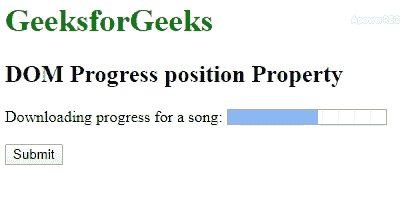

# HTML | DOM 进度位置属性

> 原文:[https://www . geesforgeks . org/html-DOM-progress-position-property/](https://www.geeksforgeeks.org/html-dom-progress-position-property/)

HTML DOM 中的**进度位置属性**用于返回进度条的当前位置。此属性的值是当前值(用 value 属性指定)除以最大值(用 max 属性指定)的结果。

**语法:**

```html
progressObject.position 
```

**返回值:**返回一个表示进度条当前位置的浮点数。

以下示例说明了 HTML DOM 中的进度位置属性:

**示例:**

```html
<!DOCTYPE html> 
<html> 

<head> 
    <title> 
        HTML DOM Progress position Property 
    </title> 
</head> 

<body> 
    <h1 style="color:green;"> 
        GeeksforGeeks 
    </h1> 

    <h2>
        DOM Progress position Property
    </h2> 

    Downloading progress for a song: 
    <progress id = "GFG" value = "57"
                max = "100"> 
    </progress> 

    <br><br> 

    <button onclick = "myGeeks()"> 
        Submit 
    </button> 

    <p id = "sudo"></p> 

    <script> 
        function myGeeks() { 
            var pr = document.getElementById(
                            "GFG").position; 

            document.getElementById("sudo")
                            .innerHTML = pr; 
        } 
    </script> 
</body> 

</html>
```

**输出:**


**支持的浏览器:****HTML DOM 进度位置属性**支持的浏览器如下:

*   谷歌 Chrome
*   Internet Explorer 10.0
*   火狐浏览器
*   Safari 6.0
*   歌剧