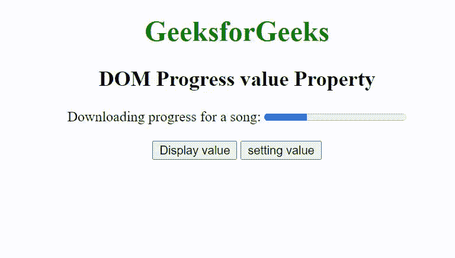

# HTML DOM 进度值属性

> 原文:[https://www . geesforgeks . org/html-DOM-progress-value-property/](https://www.geeksforgeeks.org/html-dom-progress-value-property/)

HTML DOM 中的**进度值属性**用于设置或返回<进度>元素的值。value 属性用于使用进度条指定已完成的任务。

**语法**

它返回一个值属性。

```html
progressObject.value
```

它设置 value 属性。

```html
progressObject.value = number
```

**属性值:**它包含一个代表进度条已完成任务状态的数值。

**返回值:**返回指定进度条已完成任务状态的字符串值。

**示例:**下面的代码演示了如何显示和设置 value 属性。

## 超文本标记语言

```html
<!DOCTYPE html>
<html>

<head>
    <title>
        HTML DOM Progress value Property
    </title>
</head>

<body>
    <center>
        <h1 style="color:green;">
            GeeksforGeeks
        </h1>

        <h2>DOM Progress value Property </h2>

        Downloading progress for a song:
        <progress id="GFG" value="30" max="100">
        </progress>

        <br><br>
        <button onclick="display()">
            Display value
        </button>

        <button onclick="setvalue()">
            setting value
        </button>
    </center>

    <script>
        function display() {
            var pr = document.getElementById("GFG").value;
            alert("The current status of progress Bar is:" + pr)
        }
        function setvalue() {
            var gf = document.getElementById("GFG").max = "50";
            alert("The value of the progress Bar is:" + gf);
        }
    </script>
</body>

</html>
```

**输出:**



**支持的浏览器:**

*   谷歌 Chrome
*   微软公司出品的 web 浏览器
*   火狐浏览器
*   歌剧
*   苹果 Safari