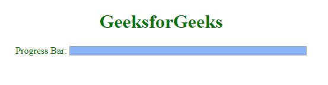

# HTML | DOM ProgressEvent

> 哎哎哎:# t0]https://www . geeksforgeeks . org/html-DOM-progress event/

ProgressEvent 接口表示测量底层进程进度的事件，如 HTTP 请求或 img、音频、视频或链接底层资源的加载。

**语法:**

```html
ProgressEvent.lengthComputable|loaded|total
```

**返回值:**它返回一个字符串值，该值代表进度的可计算长度、加载长度或总度量。

**属性:**progress event 的属性继承自其父事件。

*   **ProgressEvent . length computable:**它是一个只读属性，包含一个布尔标志，表示 progress event 所关注的资源有一个可以计算的长度。
*   **ProgressEvent.loaded:** 它是一个只读属性，包含表示底层进程已经执行的工作量的整数。可以使用属性和 ProgressEvent.total 计算完成的工作的比率。当您使用 HTTP 下载资源时，这将只代表内容本身的一部分，而不是头和其他开销。
*   **ProgressEvent.total:** 它是一个只读属性，表示底层进程正在执行的工作总量。当您使用 HTTP 下载资源时，这将只代表内容本身的一部分，而不是头和其他开销。

**事件类型:**

*   **one error:**加载外部文件时发生错误时会发生该事件
*   **onloadstart:** 当浏览器开始寻找指定的媒体时，事件将发生。

**示例:**

```html
<!DOCTYPE html>
<html>

<head>
    <title>DOM ProgressEvent</title>
</head>

<body>
    <center>
        <h1 style="color:green;">GeeksforGeeks</h1> 

        Progress Bar:
        <progress id="geeks" style="width:400px;"></progress>

        <script>
            var progressBar = document.getElementById("geeks"),
                client = new XMLHttpRequest();

            client.open("GET", "magical-unicorns");

            client.onprogress = function(pe) {
                if (pe.lengthComputable) {
                    progressBar.max = pe.total;
                    progressBar.value = pe.loaded;
                }
            }
            client.onloadend = function(pe) {
                progressBar.value = pe.loaded;
            }
            client.send();
        </script>
    </center>
</body>

</html>                    
```

**输出:**


**支持的浏览器:**DOM progress event 支持的浏览器如下:

*   Chrome 1.0
*   Internet Explorer 9.0
*   火狐浏览器
*   旅行队
*   歌剧