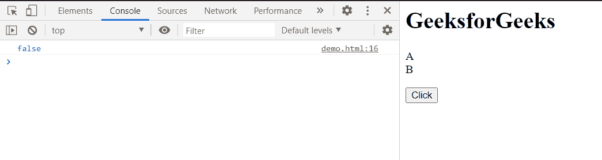

# HTML DOM queryCommandEnabled()方法

> 原文:[https://www . geesforgeks . org/html-DOM-querycommandenabled-method/](https://www.geeksforgeeks.org/html-dom-querycommandenabled-method/)

**query commandenabled()****方法**用于检查浏览器是否启用了指定的命令。

**语法:**

```html
isEnabled = document.queryCommandEnabled( command );
```

**参数:**

*   **命令:**是需要确定支援的命令。

**返回值:**返回一个布尔值，该值指定浏览器是否启用该命令。如果命令启用，则返回**真**，如果命令禁用，则返回**假**。

**示例 1:** 该示例显示了“选择全部”命令是否启用。我们可以使用这些信息，使用 **execCommand()** 方法执行命令，如果不支持，则向用户显示一条消息。

## 超文本标记语言

```html
<html>
<!DOCTYPE html>
<html>

<head>
    <title>
        HTML DOM queryCommandEnabled() method
    </title>
</head>

<body>
    <h1>GeeksforGeeks</h1>

    <p>
        A<br>
        B<br>
    </p>

    <button onclick="checkCommand()">
        Click
    </button>

    <script>
        function checkCommand() {

            // Check if the command is
            // enabled using the 
            // queryCommandEnabled() method
            var isEnabled = document
                .queryCommandEnabled("SelectAll");

            // Show the output to the console
            console.log(isEnabled);

            // Execute the command if the 
            // task is enabled
            if (isEnabled) {
                document.execCommand("SelectAll",
                    false, null);
            }
        }
    </script>
</body>

</html>
```

**输出:**

**点击按钮前:**


**点击按钮后:**


**示例 2:** 该示例显示了当给定命令不是有效命令时，该方法将返回 false 的情况。

## 超文本标记语言

```html
<!DOCTYPE html>
<html>

<head>
    <title>
        HTML DOM queryCommandEnabled() method
    </title>
</head>

<body>
    <h1>GeeksforGeeks</h1>

    <p>
        A<br>
        B<br>
    </p>

    <button onclick="checkCommand()">
        Click
    </button>

    <script>
        function checkCommand() {

            // Checking to see if an invalid
            // command is enabled
            var isEnabled =
                document.queryCommandEnabled("Select");

            // Show the output to the console
            console.log(isEnabled);
        }
    </script>
</body>

</html>
```

*   **输出:**

    **点击按钮前:**

    

*   **点击按钮后:**

    

**支持的浏览器:**:

*   谷歌 Chrome
*   边缘 12
*   Firefox 41
*   旅行队
*   歌剧
*   微软公司出品的 web 浏览器