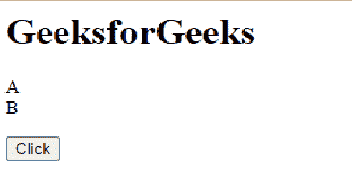
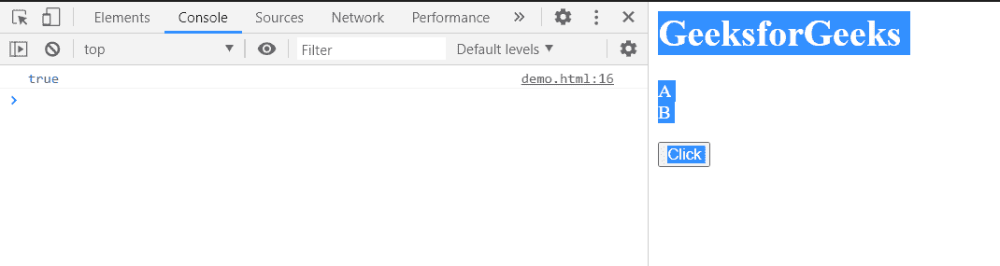
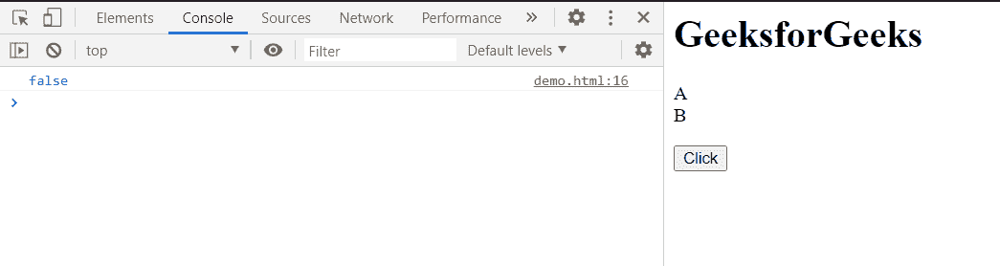

# HTML DOM query commandsupported()方法

> 原文:[https://www . geesforgeks . org/html-DOM-query commandsupported-method/](https://www.geeksforgeeks.org/html-dom-querycommandsupported-method/)

**queryCommandSupported()** 方法检查浏览器是否支持指定的编辑器命令。

**语法:**

```html
check = document.queryCommandSupported(command);
```

**参数:**该方法接受单参数**命令**，该命令保存我们想要决定浏览器是否支持的命令。

**返回值:**

*   **true** ，如果浏览器支持该命令。
*   **false** ，如果浏览器不支持该命令。

**示例 1:** 本示例演示了当 ueryCommandSupported()方法返回 **true** 时的情况。

它将显示该命令是否被支持，我们将检查“**选择所有**”命令，然后我们将通过 **execCommand()** 方法执行该命令。

## 超文本标记语言

```html
<!DOCTYPE html>
<html>

<head>
    <title>
        HTML DOM range
        queryCommandSupported() method
    </title>
</head>

<body>
    <h1>GeeksforGeeks</h1>
    <p>
        A<br>
        B<br>
    </p>
    <button onclick="sel()">Click</button>

    <script>
        function sel() {
            var check = document
                .queryCommandSupported("SelectAll");
            console.log(check);

            if (check) {
                document.execCommand(
                        "SelectAll", false, null);
            }
        }
    </script>
</body>

</html>
```

**输出:**

*   **点击按钮前:**

    

*   **点击按钮后:**在控制台中，可以看到**真**布尔值，因为浏览器支持该命令。

    

**示例 2:** 在本例中，由于浏览器不支持该命令，该方法将返回“false”。

## 超文本标记语言

```html
<!DOCTYPE html>
<html>

<head>
    <title>
        HTML DOM range 
        queryCommandSupported() method
    </title>
</head>

<body>
    <h1>GeeksforGeeks</h1>
    <p>
        A<br>
        B<br>
    </p>
    <button onclick="sel()">Click</button>

    <script>
        function sel() {
            var check = document
                .queryCommandSupported("Select");

            console.log(check);
        }
    </script>
</body>

</html>
```

**输出:**

*   **点击按钮前:**

    

*   **点击按钮后:**在本例中命令不被支持且无效，因此该方法返回**假**。

    

**支持的浏览器:**DOM**query commandsupported()**方法支持的浏览器如下。

*   谷歌 Chrome
*   边缘
*   火狐浏览器
*   旅行队
*   歌剧
*   微软公司出品的 web 浏览器