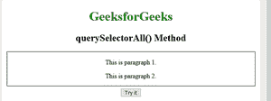
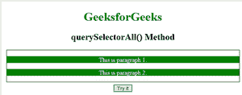

# HTML | DOM querySelectorAll()方法

> 原文:[https://www . geesforgeks . org/html-DOM-query selectorall-method/](https://www.geeksforgeeks.org/html-dom-queryselectorall-method/)

HTML 中的 **querySelectorAll()** 方法用于返回与指定 CSS 选择器匹配的元素子元素的集合，作为静态节点列表对象。NodeList 对象表示节点的集合。这些节点可以通过索引号来访问。索引从 0 开始。
**注意:**如果我们想要将 CSS 属性应用于所有匹配指定选择器的子节点，那么我们可以遍历所有节点并应用该特定属性。
**语法:**

```html
element.querySelectorAll(selectors)
```

选择器是必填字段。它指定一个或多个 CSS 选择器来匹配元素。这些选择器用于根据它们的 id、类、类型等选择 HTML 元素。
在多个选择器的情况下，用逗号分隔每个选择器。
**例:**

## 超文本标记语言

```html
<!DOCTYPE html>
<html>
    <head>
        <title>DOM querySelectorAll() Method</title>
        <style>
            #geek {
              border: 1px solid black;
              margin: 5px;
            }
        </style>
    </head>
    <body style = "text-align: center;">
        <h1 style = "color: green;">GeeksforGeeks</h1>
        <h2>querySelectorAll() Method</h2>
        <div id="geek">

<p>This is paragraph 1.</p>

<p>This is paragraph 2.</p>

        </div>
        <button onclick="myFunction()">Try it</button>
        <script>
            function myFunction() {
                var x = document.getElementById("geek").querySelectorAll("p");
                var i;
                for (i = 0; i < x.length; i++) {
                x[i].style.backgroundColor = "green";
                x[i].style.color = "white";
                }
            }
        </script>
    </body>
</html>
```

**输出:**



**点击按钮后:**



**支持的浏览器:**querySelectorAll()方法支持的浏览器如下:

*   苹果 Safari 3.2
*   谷歌 Chrome 4.0
*   Firefox 3.5
*   opera10.0
*   Internet Explorer 9.0