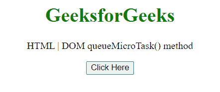
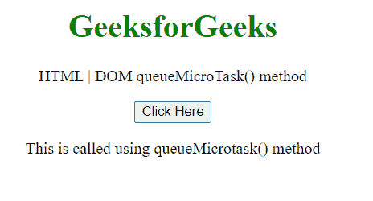

# HTML DOM queueMicrotask()方法

> 原文:[https://www . geesforgeks . org/html-DOM-queuemicrotask-method/](https://www.geeksforgeeks.org/html-dom-queuemicrotask-method/)

queueMicrotask()方法在控制返回到浏览器的事件循环之前，将一个要在安全时间执行的微任务排队。微任务是一个短函数，在当前任务完成其工作后运行，并且在执行上下文的控制返回到浏览器的事件循环之前没有其他代码等待运行。这使得您的代码可以在不干扰任何其他可能更高优先级的挂起代码的情况下运行。

**语法:**

```html
self.queueMicrotask(function);
```

**参数:**

*   **函数:**当浏览器引擎确定调用您的代码是安全的时要执行的函数。

**返回值:**未定义。

**示例:**在本例中，我们将使用此方法执行我们的函数。

## 超文本标记语言

```html
<!DOCTYPE HTML>
<html>

<body style="text-align:center;">
    <h1 style="color:green;">
        GeeksforGeeks
    </h1>

    <p>
        HTML | DOM queueMicroTask() method
    </p>

    <button onclick="Geeks()">
        Click Here
    </button>

    <p id="a"></p>

    <script>
        var a = document.getElementById("a");
        function Geeks() {
            self.queueMicrotask(() => {
                a.innerHTML = "This is called "
                + "using queueMicrotask() method";
            })
        } 
    </script>
</body>

</html>
```

**输出:**

**点击按钮前:**



**点击按钮后:**



**支持的浏览器:**

*   谷歌 Chrome
*   边缘
*   火狐浏览器
*   旅行队
*   歌剧