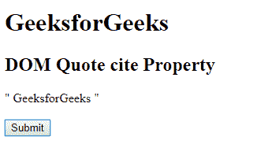
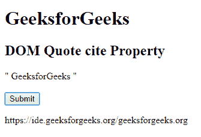
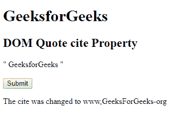

# HTML | DOM 引用引用属性

> 原文:[https://www.geeksforgeeks.org/html-dom-quote-cite-property/](https://www.geeksforgeeks.org/html-dom-quote-cite-property/)

**HTML DOM 报价引用属性**用于设置或返回报价的引用属性。cite 属性指定报价的源 URL。

**语法:**

*   它返回引用属性。

    ```html
    quoteObject.cite 
    ```

*   用于设置引用属性

    ```html
    quoteObject.cite = URL 
    ```

**属性值:**包含单值 URL，用于指定报价的 URL。该网址的可能值为:

*   **绝对 URL:** 用于指出其他网站(如 cite。= " https://www . geeksforgeeks . org ")
*   **相对 URL:** 用于指出网站内的页面。(like =“page . html”)

**返回值:**返回代表源文档网址的字符串值。

**例 1:**

```html
<!DOCTYPE html> 
<html> 
    <head> 
        <title> 
            HTML DOM Quote cite Property 
        </title> 
    </head> 

    <body> 
        <h1>GeeksforGeeks</h1> 

        <h2>DOM Quote cite Property</h2> 

        <q id = "GFG" cite = "geeksforgeeks.org"> 
            GeeksforGeeks 
        </q> 
        <br><br> 

        <button onclick = "Geeks()"> 
            Submit 
        </button> 

        <p id = "sudo"></p> 

        <script> 
            function Geeks() { 
                var ct = document.getElementById("GFG").cite; 
                document.getElementById("sudo").innerHTML = ct; 
            } 
        </script> 
    </body> 
</html>                             
```

**输出:**

*   **点击按钮前:**
    
*   **点击按钮后:**
    

**例 2:**

```html
<!DOCTYPE html> 
<html> 
    <head> 
        <title> 
            HTML DOM Quote cite Property 
        </title> 
    </head> 

    <body> 
        <h1>GeeksforGeeks</h1> 

        <h2>DOM Quote cite Property</h2> 

        <q id = "GFG" cite = "Finecomb.com"> 
            GeeksforGeeks 
        </q> 
        <br><br> 

        <button onclick = "Geeks()"> 
            Submit 
        </button> 

        <p id = "sudo"></p> 

        <script> 
            function Geeks() { 
                var ct = document.getElementById("GFG").cite
                         = "www.geeksforgeeks.org"; 

                document.getElementById("sudo").innerHTML
                     = "The cite was changed to " + ct; 
            } 
        </script> 
    </body> 
</html>                             
```

**输出:**

*   **点击按钮前:**
    
*   **点击按钮后:**
    

**支持的浏览器:**支持的浏览器 **HTML DOM 引用属性**如下:

*   谷歌 Chrome
*   微软公司出品的 web 浏览器
*   火狐浏览器
*   苹果 Safari
*   歌剧