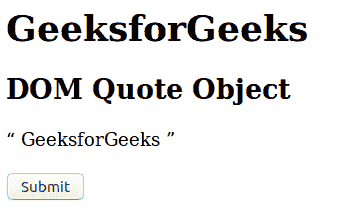
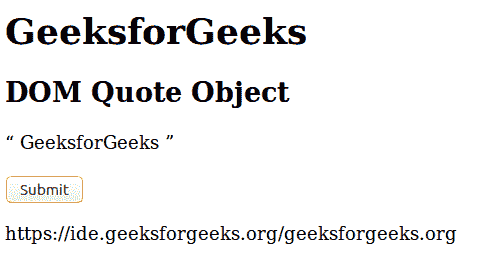
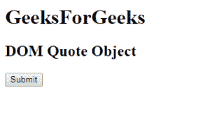
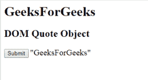

# HTML | DOM 引用对象

> 原文:[https://www.geeksforgeeks.org/html-dom-quote-object/](https://www.geeksforgeeks.org/html-dom-quote-object/)

HTML DOM 中的引用对象用来表示 HTML q 元素。可以通过使用 getElementById()方法访问报价元素。
**属性值:**包含单属性值 [***引用*** **。**](https://www.geeksforgeeks.org/html-dom-quote-cite-property/?ref=rp) 该属性用于设置或返回一个< q >元素中引用属性的值。
**语法:**

```html
document.getElementById("ID");
```

其中标识被分配给报价标签。
**例 1:**

## 超文本标记语言

```html
<!DOCTYPE html>
<html>
    <head>
        <title>
            HTML DOM Quote Object
        </title>
    </head>

    <body>
        <h1>GeeksforGeeks</h1>

        <h2>DOM Quote Object</h2>

        <q id = "GFG" cite = "geeksforgeeks.org">
            GeeksforGeeks
        </q> <br><br>

        <button onclick = "Geeks()">
            Submit
        </button>

        <p id = "sudo"></p>

        <script>
            function Geeks() {
                var ct = document.getElementById("GFG").cite;
                document.getElementById("sudo").innerHTML = ct;
            }
        </script>
    </body>
</html>                             
```

**输出:**
**之前点击按钮:**



**点击按钮后:**



**示例 2:** 可以使用*文档创建元素方法创建报价对象。*

## 超文本标记语言

```html
<!DOCTYPE html>
<html>
    <head>
        <title>
            HTML DOM Quote Object
        </title>
    </head>

    <body>
        <h1>GeeksForGeeks</h1>

        <h2>DOM Quote Object</h2>

        <button onclick = "Geeks()">
            Submit
        </button>

        <script>
            function Geeks() {
                var quote = document.createElement("Q");
                var txt = document.createTextNode("GeeksForGeeks");
                quote.setAttribute("cite",
                        "http://www.geeksforgeeks.org, in");

                quote.appendChild(txt);
                document.body.appendChild(quote);
            }
        </script>
    </body>
</html>                                   
```

**输出:**
**之前点击按钮:**



**点击按钮后:**



**支持的浏览器:***DOM Quote Object*支持的浏览器如下:

*   谷歌 Chrome
*   微软公司出品的 web 浏览器
*   火狐浏览器
*   歌剧
*   旅行队