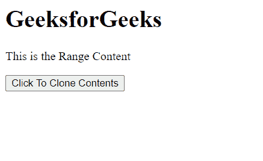
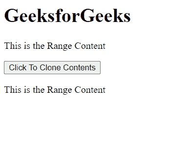

# HTML DOM 范围克隆内容()方法

> 原文:[https://www . geesforgeks . org/html-DOM-range-clone contents-method/](https://www.geeksforgeeks.org/html-dom-range-clonecontents-method/)

**克隆内容()**返回一个文档片段对象，复制范围中包含的节点和内容。所有范围内容都可以克隆到一个 DocumentFragment 对象中。

**cloneContents()** 方法类似于 **extractContents()** 方法，但是 extractContents()方法将内容复制到一个对象变量，并从 DOM 树中移除范围内容，而 cloneContents()方法将内容复制到一个对象变量，但**不会**从 DOM 树中移除范围内容。

**语法:**

```html
documentFragment = range.cloneContents();

```

**参数:**该方法不取任何参数。

**返回值:**该方法返回一个从范围内容创建的**文档片段**对象。

**示例:**这个示例展示了如何创建一个 **DocumentFragment** 对象，并使用这个方法将其追加到文档中。

## 超文本标记语言

```html
<html>
<head>
<title>HTML DOM range cloneContents() method</title>   
</head>
<body>
    <h1>GeeksforGeeks</h1>

<p>This is the Range Content</p>

    <button onclick="clone()">Click To Clone Contents</button>
</body>
<script>
    let range = document.createRange();
    let referenceNode = document.getElementsByTagName('p').item(0);
    range.selectNode(referenceNode);
    function clone(){
        documentFragment = range.cloneContents();
        document.body.appendChild(documentFragment);
        console.log(documentFragment)   
    }
</script>
</html>
```

**输出:**

**按钮点击前:**



**按钮点击后:**



**支持的浏览器:**

*   谷歌 Chrome
*   边缘
*   火狐浏览器
*   旅行队
*   歌剧
*   微软公司出品的 web 浏览器