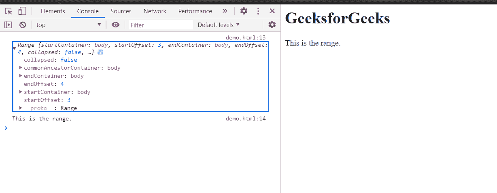

# HTML DOM 范围克隆()方法

> 原文:[https://www . geesforgeks . org/html-DOM-range-clone range-method/](https://www.geeksforgeeks.org/html-dom-range-clonerange-method/)

使用**克隆方法()**对原始范围进行**克隆，并将克隆的**范围**对象返回到新变量中。**

**注意:**任一范围的变化不影响另一范围。

**语法:**

```html
newRange = originalRange.cloneRange();
```

**参数:**此方法不接受任何参数。

**返回值:**该方法返回**新创建的范围对象。**

**示例:**在本例中，克隆了一个范围。为了更清楚地说明克隆范围，使用 **toString()** 方法将克隆范围转换为字符串文本，并在控制台中显示该克隆范围对象。

## 超文本标记语言

```html
<!DOCTYPE html>
<html>

<head>
    <title>
        HTML DOM range cloneRange() method
    </title>
</head>

<body>
    <h1>GeeksforGeeks</h1>

    <p>This is the range.</p>

    <script>
        originalRange = document.createRange();

        originalRange.selectNode(document
            .getElementsByTagName("p").item(0));

        clonedRange = originalRange.cloneRange();
        console.log(clonedRange);
        console.log(clonedRange.toString());
    </script>
</body>

</html>
```

**输出:**在控制台中，可以看到新克隆的范围对象。



**支持的浏览器:**

*   谷歌 Chrome
*   边缘
*   火狐浏览器
*   旅行队
*   歌剧